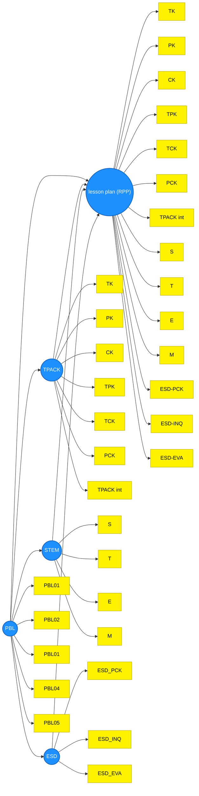

# Bagan Model (Mermaid)

```mermaid
flowchart LR
  %% Latent constructs
  PBL((PBL))
  TPACK((TPACK))
  STEM((STEM))
  ESD((ESD))
  RPP(("lesson plan (RPP)"))

  %% Structural paths
  PBL --> TPACK
  PBL --> STEM
  PBL --> ESD
  PBL --> RPP
  TPACK --> RPP
  STEM --> RPP
  ESD --> RPP

  %% PBL indicators
  pj1[PBL01]
  pj2[PBL02]
  pj3[PBL01]
  pj4[PBL04]
  pj5[PBL05]

  PBL --> pj1
  PBL --> pj2
  PBL --> pj3
  PBL --> pj4
  PBL --> pj5

  %% TPACK indicators
  tk[TK]
  pk[PK]
  ck[CK]
  tpk[TPK]
  tck[TCK]
  pck[PCK]
  tpackint["TPACK int"]

  TPACK --> tk
  TPACK --> pk
  TPACK --> ck
  TPACK --> tpk
  TPACK --> tck
  TPACK --> pck
  TPACK --> tpackint

  %% STEM indicators
  stem_s[S]
  stem_t[T]
  stem_e[E]
  stem_m[M]

  STEM --> stem_s
  STEM --> stem_t
  STEM --> stem_e
  STEM --> stem_m

  %% ESD indicators
  esd1[ESD_PCK]
  esd2[ESD_INQ]
  esd3[ESD_EVA]

  ESD --> esd1
  ESD --> esd2
  ESD --> esd3

  %% lesson plan (RPP) indicators
  r1[TK]
  r2[PK]
  r3[CK]
  r4[TPK]
  r5[TCK]
  r6[PCK]
  r7["TPACK int"]
  r8[S]
  r9[T]
  r10[E]
  r11[M]
  r12[ESD-PCK]
  r13[ESD-INQ]
  r14[ESD-EVA]

  RPP --> r1
  RPP --> r2
  RPP --> r3
  RPP --> r4
  RPP --> r5
  RPP --> r6
  RPP --> r7
  RPP --> r8
  RPP --> r9
  RPP --> r10
  RPP --> r11
  RPP --> r12
  RPP --> r13
  RPP --> r14

  %% Styling
  classDef latent fill:#1e90ff,color:#ffffff,stroke:#1565c0,stroke-width:2px;
  classDef indicator fill:#fff200,color:#000000,stroke:#b8a800,stroke-width:1px;

  class PBL,TPACK,STEM,ESD,RPP latent;
  class pj1,pj2,pj3,pj4,pj5,tk,pk,ck,tpk,tck,pck,tpackint,stem_s,stem_t,stem_e,stem_m,esd1,esd2,esd3,r1,r2,r3,r4,r5,r6,r7,r8,r9,r10,r11,r12,r13,r14 indicator;
```
