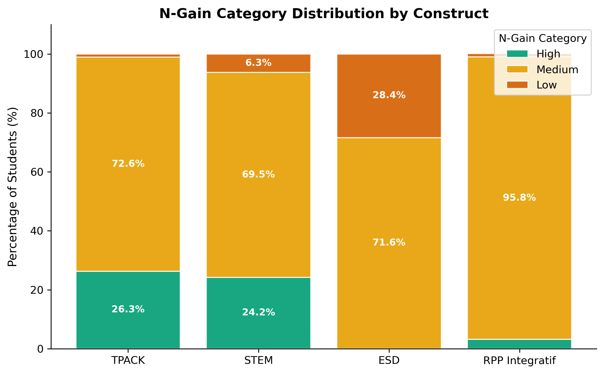
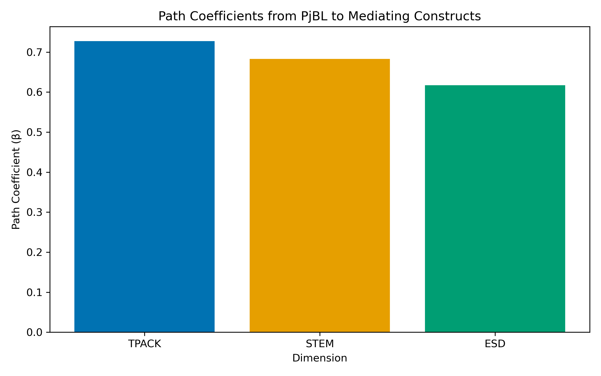
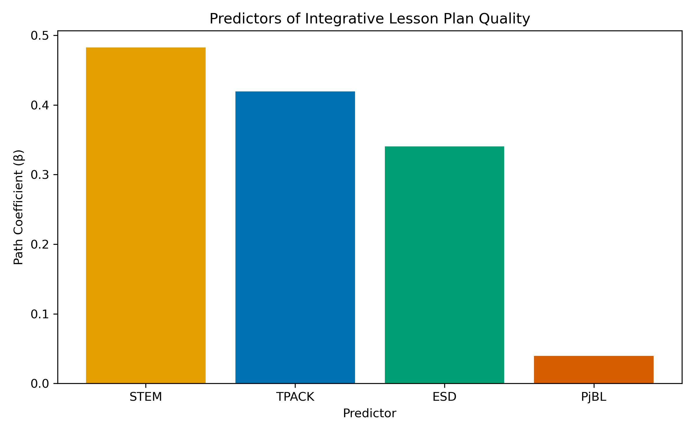
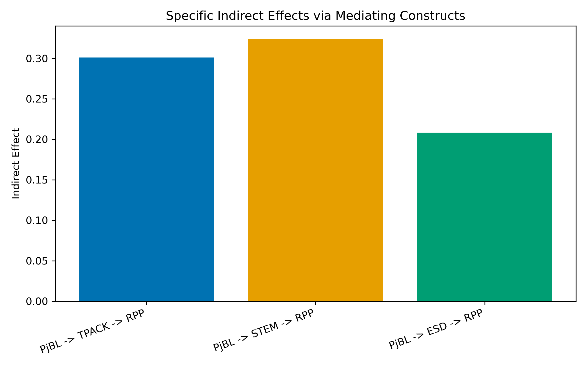

<!-- Dibuat otomatis oleh merge_paper.py (lang=id) | Total: ~11600 kata | Seksi: 8/8 -->

# Bagaimana Project-Based Learning Meningkatkan Kompetensi Desain RPP Integratif Calon Guru IPA: Pendekatan Structural Equation Modeling

**Penulis:**

Novi Ratna Dewi^1*^ , Rizki Nor Amelia^1^ , Septiko Aji^1^ , Ismail Okta Kurniawan^1^ 

**Afiliasi:**

^1^ Fakultas Matematika dan Ilmu Pengetahuan Alam, Universitas Negeri Semarang, Jawa Tengah, Indonesia

**Corresponding author:** *noviratnadewi@mail.unnes.ac.id

**Kata kunci:** Project-Based Learning, TPACK, Pendidikan STEM, Education for Sustainable Development, Desain RPP Integratif, Calon Guru IPA, PLS-SEM, Kompetensi Desain Guru

---

## Abstrak

Mempersiapkan calon guru IPA untuk merancang RPP yang secara simultan mengintegrasikan Technological Pedagogical Content Knowledge (TPACK), Science-Technology-Engineering-Mathematics (STEM), dan Education for Sustainable Development (ESD) merupakan tantangan kritis namun kurang diteliti dalam pendidikan guru. Penelitian ini menguji pengaruh Project-Based Learning (PjBL) terhadap pengembangan ketiga dimensi integrasi tersebut dan kualitas RPP integratif secara keseluruhan, serta memodelkan hubungan struktural di antaranya. Desain pra-eksperimen one-group pretest-posttest diterapkan pada 95 calon guru IPA di sebuah universitas negeri di Indonesia. Data dikumpulkan melalui penilaian berbasis rubrik terhadap RPP yang mencakup 14 indikator dan kuesioner kualitas implementasi PjBL, kemudian dianalisis menggunakan uji berpasangan, analisis normalized gain (N-Gain), dan Partial Least Squares Structural Equation Modeling (PLS-SEM) dengan 5.000 iterasi bootstrap. Seluruh konstruk meningkat secara signifikan setelah intervensi PjBL, dengan ukuran efek besar (Cohen's $d > 2{,}3$) dan nilai N-Gain kategori Medium; namun, ESD menunjukkan N-Gain terlemah, tanpa partisipan yang mencapai N-Gain High. Hasil PLS-SEM mengungkapkan bahwa PjBL secara signifikan memprediksi ketiga dimensi integrasi dengan ukuran efek besar: TPACK ($\beta = 0{,}727$, $p < 0{,}001$, $f^2 = 1{,}123$), STEM ($\beta = 0{,}683$, $p < 0{,}001$, $f^2 = 0{,}872$), dan ESD ($\beta = 0{,}617$, $p < 0{,}001$, $f^2 = 0{,}614$). Ketiga dimensi berkontribusi signifikan terhadap kualitas RPP integratif dengan ukuran efek besar. Pola full mediation teramati: PjBL mempengaruhi kualitas RPP melalui peningkatan ketiga kompetensi integrasi, dengan efek tidak langsung signifikan melalui jalur STEM ($\beta = 0{,}330$), TPACK ($\beta = 0{,}309$), dan ESD ($\beta = 0{,}213$). Total indirect effect substansial ($\beta = 0{,}852$, $p < 0{,}001$), sementara direct effect tidak signifikan. Temuan ini memberikan uji empiris pertama dari model struktural yang menghubungkan PjBL dengan desain RPP integratif melalui jalur TPACK, STEM, dan ESD, menawarkan panduan praktis bagi institusi pendidikan guru yang berupaya mengembangkan kompetensi desain komprehensif pada calon guru IPA.

---

## Pernyataan Etika

Penelitian ini dilaksanakan sesuai dengan pedoman etika Deklarasi Helsinki. Seluruh partisipan telah diinformasikan mengenai tujuan dan prosedur penelitian serta memberikan persetujuan tertulis sebelum berpartisipasi. Partisipasi bersifat sukarela, dan partisipan dapat mengundurkan diri kapan saja tanpa konsekuensi. Tidak ada informasi identitas pribadi yang dikumpulkan di luar keperluan penelitian.

## Pernyataan Konflik Kepentingan

Para penulis menyatakan bahwa penelitian ini dilaksanakan tanpa adanya hubungan komersial atau finansial yang dapat ditafsirkan sebagai potensi konflik kepentingan.

## Pernyataan Pendanaan

Penelitian ini tidak menerima pendanaan eksternal.

## Pernyataan Ketersediaan Data

Dataset yang dihasilkan dan dianalisis dalam penelitian ini tersedia dari corresponding author berdasarkan permintaan yang wajar.

## Kontribusi Penulis

**Novi Ratna Dewi:** Konseptualisasi, Metodologi, Validasi, Analisis formal, Investigasi, Penulisan – draft awal, Penulisan – revisi & editing, Supervisi, Administrasi proyek. **Rizki Nor Amelia:** Investigasi, Kurasi data, Penulisan – revisi & editing. **Septiko Aji:** Kurasi data, Visualisasi. **Ismail Okta Kurniawan:** Kurasi data, Perangkat lunak.

---

## 1. Pendahuluan

Lanskap pendidikan IPA abad ke-21 menuntut guru memiliki kompetensi multifaset yang melampaui penguasaan konten disiplin ilmu semata. Guru IPA kini diharapkan merancang pembelajaran yang secara bermakna mengintegrasikan teknologi digital, mendorong penalaran interdisipliner, dan mengatasi tantangan keberlanjutan yang mendesak (UNESCO, 2017; Kelley & Knowles, 2016). Ekspektasi ini sangat akut bagi calon guru IPA, yang persiapan profesionalnya harus membekali mereka tidak hanya dengan pengetahuan teoretis tentang kerangka pedagogis individual, tetapi juga dengan kapasitas praktis untuk menenun berbagai kerangka menjadi RPP yang koheren. Namun, program pendidikan guru yang ada sering memperlakukan dimensi-dimensi ini—Technological Pedagogical Content Knowledge (TPACK), integrasi Science-Technology-Engineering-Mathematics (STEM), dan Education for Sustainable Development (ESD)—sebagai silo kurikuler terpisah, membiarkan calon guru menavigasi kompleksitas desain RPP integratif sebagian besar sendirian.

Kemampuan merancang RPP integratif—RPP yang secara simultan menyematkan pedagogi berbasis teknologi, koneksi STEM interdisipliner, dan perspektif keberlanjutan—merepresentasikan kompetensi profesional tingkat tinggi yang oleh Brown (2009) disebut *teacher design capacity*. Kapasitas ini bukan sekadar jumlah keterampilan terisolasi, melainkan kompetensi yang muncul (emergent) yang mengharuskan guru mengorkestrasikan berbagai bentuk pengetahuan secara serempak (McKenney et al., 2015). Mishra dan Koehler (2006) mengartikulasikan satu komponen kritis dari orkestrasi ini melalui kerangka TPACK, yang menggambarkan domain pengetahuan yang bersinggungan yang memungkinkan guru memanfaatkan teknologi untuk pedagogi spesifik konten. Literatur berikutnya memperluas logika integratif ini ke pendidikan STEM, di mana desain pelajaran yang efektif menuntut pencampuran yang disengaja dari inkuiri ilmiah, aplikasi teknologi, desain rekayasa, dan penalaran matematis (Kelley & Knowles, 2016; Pitot et al., 2024; Portillo-Blanco et al., 2025). Lebih baru lagi, imperatif global untuk pendidikan keberlanjutan telah memperkenalkan dimensi integrasi ketiga: kompetensi ESD mengharuskan guru menyematkan isu keberlanjutan, pendekatan berbasis inkuiri terhadap tantangan lingkungan, dan pemikiran evaluatif tentang dilema sosio-ilmiah ke dalam pengajaran IPA mereka (UNESCO, 2017; Purwianingsih et al., 2022; Vidal & Kuckuck, 2025).

Meskipun pentingnya setiap dimensi diakui, literatur empiris mengungkapkan lanskap yang terfragmentasi. Studi yang menguji pengembangan TPACK di kalangan calon guru IPA berlimpah (misalnya, Offermann et al., 2025; Salleh et al., 2025; Stinken-Rosner et al., 2023), begitu pula investigasi kompetensi integrasi STEM (Tucker et al., 2024; Mansour et al., 2024) dan, dalam tingkat lebih rendah, kapabilitas pedagogis ESD (Purwianingsih et al., 2022; Vidal & Kuckuck, 2025). Namun, aliran penelitian ini sebagian besar berkembang secara terpisah satu sama lain. Sedikit studi yang menguji bagaimana calon guru mengembangkan kemampuan mengintegrasikan ketiga dimensi secara simultan, dan belum ada studi yang memodelkan hubungan struktural di antara TPACK, STEM, dan ESD sebagai jalur mediasi yang melaluinya intervensi instruksional mempengaruhi kualitas RPP integratif.

Project-Based Learning (PjBL) menawarkan intervensi yang secara teoretis menarik untuk mendorong kompetensi desain RPP integratif. PjBL, didefinisikan sebagai proses inkuiri yang diperpanjang yang terstruktur di sekitar pertanyaan pendorong autentik dan berpuncak pada artefak yang dibagikan secara publik (Krajcik & Shin, 2014), secara alami mengundang aktivasi simultan dari berbagai domain pengetahuan. Ketika calon guru IPA ditugaskan merancang RPP melalui proses PjBL, mereka harus berinteraksi dengan teknologi untuk mendukung inkuiri (mengaktifkan TPACK), memanfaatkan koneksi interdisipliner untuk mengatasi masalah autentik (mengaktifkan integrasi STEM), dan mempertimbangkan dimensi keberlanjutan dari isu ilmiah (mengaktifkan kompetensi ESD). Bukti empiris mendukung efektivitas PjBL dalam mengembangkan dimensi individual: Dewi et al. (2022) menunjukkan bahwa model scaffolding PjBL meningkatkan TPACK calon guru, sementara studi yang lebih baru juga melaporkan peningkatan kualitas desain unit STEM interdisipliner pada calon guru (Pitot et al., 2024; Portillo-Blanco et al., 2025). Namun, mekanisme yang melaluinya PjBL mempengaruhi kualitas RPP integratif—apakah secara langsung atau melalui peningkatan kompetensi TPACK, STEM, dan ESD yang dimediasi—tetap belum diuji secara empiris.

Kesenjangan ini berimplikasi untuk teori dan praktik. Secara teoretis, memahami apakah PjBL beroperasi melalui mediasi dimensional (yaitu, PjBL → TPACK/STEM/ESD → kualitas RPP) daripada melalui efek langsung pada kualitas RPP akan memajukan pemahaman kita tentang bagaimana intervensi pedagogis diterjemahkan menjadi kompetensi desain. Bukti semacam itu akan memperbaiki kerangka Teacher Design Capacity (Brown, 2009) dengan menspesifikasi jalur komposisional yang melaluinya kompetensi desain dibangun. Secara praktis, mengidentifikasi dimensi integrasi mana yang paling responsif terhadap PjBL akan memungkinkan pendidik guru mengkalibrasi penekanan instruksional dan strategi scaffolding mereka—misalnya, memberikan dukungan tambahan untuk dimensi yang tidak cukup dikembangkan oleh PjBL saja.

Penelitian ini mengatasi kesenjangan tersebut dengan mengusulkan dan menguji model struktural di mana PjBL berfungsi sebagai prediktor eksogen dari tiga dimensi integrasi (TPACK, STEM, dan ESD), yang pada gilirannya berkontribusi terhadap kualitas RPP integratif. Model dievaluasi menggunakan Partial Least Squares Structural Equation Modeling (PLS-SEM), pendekatan berbasis varians yang cocok untuk sifat eksploratori-konfirmatori dari investigasi ini, ukuran sampel yang moderat (N = 95), dan karakteristik formatif dari beberapa konstruk (Hair et al., 2022). Lima pertanyaan penelitian memandu investigasi:

> **RM1.** Bagaimana kompetensi integrasi TPACK, STEM, dan ESD calon guru IPA dalam desain RPP berubah dari pre- ke post-intervensi PjBL?

> **RM2.** Apakah implementasi PjBL secara signifikan mempengaruhi kualitas desain RPP di seluruh dimensi integrasi TPACK, STEM, dan ESD?

> **RM3.** Dimensi integrasi mana (TPACK, STEM, atau ESD) yang paling kuat dipengaruhi oleh PjBL?

> **RM4.** Bagaimana kompetensi integrasi TPACK, STEM, dan ESD berkontribusi terhadap kualitas RPP integratif secara keseluruhan setelah implementasi PjBL?

> **RM5.** Apakah peningkatan TPACK, STEM, dan ESD memediasi pengaruh PjBL terhadap kualitas RPP integratif?

Hipotesis berikut diajukan berdasarkan kerangka teoretis:

- **H1:** PjBL secara positif dan signifikan mempengaruhi kompetensi integrasi TPACK, STEM, dan ESD.
- **H2:** Kompetensi integrasi TPACK, STEM, dan ESD secara signifikan berkontribusi terhadap kualitas RPP integratif.
- **H3:** TPACK, STEM, dan ESD memediasi hubungan antara PjBL dan kualitas RPP integratif.

Penelitian ini berkontribusi pada literatur dalam tiga cara. Pertama, menawarkan uji empiris pertama dari model integratif yang secara simultan memposisikan TPACK, STEM, dan ESD sebagai dimensi mediasi antara intervensi pedagogis dan kualitas RPP. Kedua, mengoperasionalisasikan kualitas RPP integratif sebagai konstruk tingkat tinggi yang dinilai melalui evaluasi berbasis rubrik daripada self-report, meningkatkan validitas ekologis pengukuran. Ketiga, dengan menggunakan PLS-SEM untuk menguraikan efek langsung, tidak langsung, dan total, penelitian ini memberikan wawasan granular tentang mekanisme yang melaluinya PjBL membentuk kompetensi desain calon guru IPA—wawasan yang memiliki implikasi langsung untuk desain kurikulum di institusi pendidikan guru.

---

## 2. Tinjauan Pustaka

### 2.1 Project-Based Learning dalam Pendidikan Guru

Project-Based Learning (PjBL) adalah pendekatan instruksional yang diorganisasikan di sekitar pertanyaan autentik dan kompleks yang mendorong investigasi berkelanjutan, inkuiri kolaboratif, dan penciptaan artefak nyata (Krajcik & Shin, 2014). Dalam konteks pendidikan guru, PjBL memiliki fungsi ganda: secara bersamaan berfungsi sebagai strategi pedagogis yang dialami oleh calon guru sebagai peserta didik dan sebagai metodologi desain yang harus mereka pelajari untuk diterapkan sebagai praktisi di masa depan. Posisi ganda ini menjadikan PjBL sangat potensial untuk mengembangkan kompetensi desain guru, karena proses pembuatan artefak instruksional—seperti rencana pelaksanaan pembelajaran—dalam kondisi PjBL membutuhkan mobilisasi aktif dan integrasi berbagai domain pengetahuan.

Elemen-elemen esensial PjBL meliputi pertanyaan pendorong yang berlabuh pada masalah dunia nyata, inkuiri berkelanjutan melalui investigasi dan penelitian, kolaborasi antar peserta didik, penciptaan artefak yang dibagikan secara publik, dan refleksi terstruktur (Bell, 2010; Krajcik & Shin, 2014). Ketika diterapkan pada persiapan guru, elemen-elemen ini diterjemahkan ke dalam pedagogi berbasis desain di mana calon guru merumuskan tujuan instruksional seputar masalah ilmiah autentik, menginvestigasi konten dan strategi pedagogis, merancang rencana pembelajaran secara kolaboratif, terlibat dalam peer review dan revisi, serta merefleksikan koherensi dan kualitas desain mereka.

Bukti empiris mendukung efektivitas PjBL dalam mengembangkan berbagai dimensi kompetensi guru. Dewi et al. (2022) menunjukkan bahwa model scaffolding PjBL secara signifikan meningkatkan TPACK dan kemampuan desain pembelajaran calon guru IPA, dengan struktur scaffolding terbukti esensial untuk membimbing desainer pemula melalui kompleksitas perencanaan pembelajaran terintegrasi teknologi. Novallyan dan Nehru (2025) menemukan bahwa optimalisasi mata kuliah profesi guru melalui metode proyek meningkatkan kompetensi pedagogis mahasiswa pendidikan biologi. Akbulut dan Oner (2021) melaporkan bahwa pengalaman PjBL meningkatkan kompetensi terkait teknologi calon guru. Markula dan Aksela (2022) juga menunjukkan bahwa implementasi PBL pada konteks IPA K-12 cenderung memperkuat kolaborasi, produksi artefak, dan praktik inkuiri, meskipun elemen seperti pertanyaan pendorong yang sepenuhnya dihasilkan siswa masih menantang. Studi yang lebih baru juga menunjukkan peningkatan pada kualitas desain unit STEM interdisipliner dan design thinking calon guru, memperkuat nilai PjBL untuk pendidikan guru berbasis desain (Pitot et al., 2024; Portillo-Blanco et al., 2025; Yuksel, 2025). Secara kolektif, studi-studi ini menetapkan PjBL sebagai intervensi yang viable untuk meningkatkan dimensi spesifik kompetensi guru, meskipun belum ada yang meneliti pengaruh simultan PjBL terhadap multiple dimensi integrasi dalam satu model struktural.

### 2.2 Technological Pedagogical Content Knowledge (TPACK)

Kerangka TPACK, diperkenalkan oleh Mishra dan Koehler (2006) dan berlandaskan pada konstruk seminal Shulman (1986) tentang Pedagogical Content Knowledge (PCK), mengartikulasikan domain pengetahuan yang beririsan yang diperlukan untuk pengajaran efektif dengan peningkatan teknologi. TPACK terdiri dari tujuh komponen: Technology Knowledge (TK), Pedagogical Knowledge (PK), Content Knowledge (CK), dan irisan berpasangannya—Technological Pedagogical Knowledge (TPK), Technological Content Knowledge (TCK), dan Pedagogical Content Knowledge (PCK)—yang memuncak pada inti integratif TPACK itu sendiri, yang merepresentasikan pengetahuan yang diperlukan untuk mengajarkan konten spesifik dengan teknologi yang tepat menggunakan strategi pedagogis yang sesuai.

Bagi calon guru IPA, pengembangan TPACK sangat kritis karena pembelajaran sains semakin bergantung pada alat digital untuk simulasi, pengumpulan data, visualisasi, dan inkuiri kolaboratif. Pengukuran TPACK telah berevolusi dari survei laporan diri menuju asesmen berbasis kinerja, termasuk rencana pembelajaran yang dievaluasi dengan rubrik yang menangkap integrasi teknologi, pedagogi, dan konten yang diterapkan (Offermann et al., 2025). Pendekatan berbasis kinerja ini diadopsi dalam studi ini, di mana indikator TPACK dinilai melalui kualitas komponen rencana pembelajaran, bukan melalui pengetahuan yang dipersepsikan sendiri.

Studi-studi pemodelan persamaan struktural terbaru telah meneliti TPACK dalam kaitannya dengan konstruk lain. Mansour et al. (2024) menginvestigasi integrasi TPACK dalam konteks pendidikan STEM di Qatar, menemukan hubungan struktural signifikan antara komponen TPACK dan efikasi pengajaran STEM. Salleh et al. (2025) mengeksplorasi trajektori pengembangan TPACK di kalangan calon guru, mengidentifikasi pengetahuan konten dan efikasi diri teknologi sebagai prediktor kunci. Stinken-Rosner et al. (2023) juga melaporkan bahwa modul implementasi teknologi yang terstruktur dalam pendidikan calon guru IPA meningkatkan TPACK sekaligus orientasi perilaku terhadap penggunaan teknologi di kelas. Studi-studi ini memberikan preseden metodologis untuk pendekatan SEM yang diadopsi di sini, sekaligus menyoroti kesenjangan bahwa TPACK jarang dimodelkan bersama STEM dan ESD dalam satu kerangka struktural tunggal.

### 2.3 Pendidikan STEM dan Desain Pembelajaran Integratif

Pendidikan STEM, dikonseptualisasikan sebagai integrasi purposif dari disiplin sains, teknologi, teknik, dan matematika, telah mendapatkan traksi substansial baik sebagai filosofi pendidikan maupun kerangka kurikuler (Kelley & Knowles, 2016). Perbedaan antara instruksi STEM disipliner—di mana mata pelajaran diajarkan secara terpisah—dan pendidikan STEM integratif—di mana batas-batas disipliner sengaja dilewati untuk mengatasi masalah kompleks—sangat konsekuensial untuk desain rencana pembelajaran. Instruksi STEM integratif mengharuskan guru untuk merancang pengalaman belajar yang menanamkan proses desain teknik, penalaran matematis, dan aplikasi teknologi dalam konten sains, tugas desain yang menuntut yang sering sulit dicapai oleh guru pemula.

Kelley dan Knowles (2016) mengusulkan kerangka konseptual untuk pendidikan STEM terintegrasi yang menekankan pembelajaran situated, desain teknik sebagai strategi pedagogis, inkuiri ilmiah sebagai proses pembangunan pengetahuan, dan pemikiran matematis sebagai fondasi analitis. Dalam kerangka ini, kualitas rencana pembelajaran terintegrasi STEM dapat dievaluasi sepanjang empat dimensi: akurasi dan kedalaman konten sains, integrasi purposif teknologi, kehadiran pemikiran desain teknik, dan aplikasi penalaran matematis.

Bagi calon guru IPA, mengembangkan kompetensi integrasi STEM membutuhkan gerakan melampaui zona nyaman disipliner dan mengembangkan apa yang Tucker et al. (2024) gambarkan sebagai efikasi diri STEM—kepercayaan diri dan kapabilitas untuk merancang pengalaman belajar interdisipliner. Kerangka PBL-STEM terbaru untuk calon guru juga menegaskan bahwa perencanaan kolaboratif lintas mata kuliah dan integrasi eksplisit engineering design menjadi pengungkit penting kompetensi ini (Pitot et al., 2024; Portillo-Blanco et al., 2025). Riset design-based virtual internship juga menunjukkan bahwa latihan desain berkelanjutan yang disertai umpan balik dapat memperkuat keahlian desain pembelajaran STEM calon guru (Wu et al., 2021). Tantangan ini sangat akut untuk integrasi terkait ESD, di mana calon guru harus mempertimbangkan konteks keberlanjutan yang kurang familiar dibandingkan topik STEM tradisional.

### 2.4 Education for Sustainable Development (ESD) dalam Pengajaran IPA

Education for Sustainable Development merepresentasikan paradigma pendidikan global yang berupaya membekali peserta didik dengan pengetahuan, keterampilan, nilai, dan sikap yang diperlukan untuk mengatasi tantangan keberlanjutan yang saling terhubung (UNESCO, 2017). Untuk pendidikan guru IPA, ESD memperkenalkan kompetensi spesifik yang melampaui pedagogi IPA tradisional: kemampuan untuk menghubungkan konsep ilmiah dengan isu keberlanjutan (ESD-PCK), untuk menggunakan pendekatan berbasis inkuiri dalam menginvestigasi tantangan lingkungan dan sosial (ESD-INQ), dan untuk memupuk pemikiran evaluatif tentang dilema sosio-ilmiah dan trade-off (ESD-EVA) (UNECE, 2012).

Purwianingsih et al. (2022) mengembangkan program untuk mengintegrasikan ESD ke dalam TPACK calon guru biologi, membangun jembatan teoretis dan praktis antara integrasi teknologi dan pendidikan keberlanjutan. Karya mereka, yang diterbitkan di *Journal of Pendidikan IPA Indonesia (JPII)*, mendemonstrasikan bahwa program integrasi terstruktur dapat meningkatkan kapasitas calon guru untuk menanamkan perspektif keberlanjutan dalam pelajaran IPA yang ditingkatkan teknologi. Shumba dan Kampamba (2013) lebih lanjut mengeksplorasi pengetahuan konten pedagogis spesifik ESD, berargumen bahwa guru memerlukan pengetahuan khusus untuk menerjemahkan konsep keberlanjutan abstrak ke dalam aksi pedagogis konkret.

Meskipun ada kemajuan-kemajuan ini, ESD tetap menjadi dimensi yang paling kurang berkembang dari tiga dimensi integrasi dalam penelitian pendidikan guru. Tidak seperti TPACK, yang diuntungkan oleh dekade investigasi empiris, dan integrasi STEM, yang didukung oleh infrastruktur kebijakan substansial, integrasi ESD dalam desain rencana pembelajaran masih merupakan area yang berkembang. Sintesis terbaru juga menunjukkan bahwa action competence ESD calon guru masih relatif lemah dan sering diukur melalui self-report potong lintang, sehingga asesmen berbasis kinerja dan berbasis tugas desain menjadi krusial (Vidal & Kuckuck, 2025; Singh-Pillay, 2023). Bukti pelengkap juga menunjukkan bahwa pengetahuan SDG calon guru pada konteks pelatihan awal masih sering terbatas, sehingga dukungan kurikuler ESD yang eksplisit tetap dibutuhkan (Calero et al., 2024). Kebaruan relatif ini memiliki implikasi untuk studi ini: kompetensi ESD mungkin memerlukan scaffolding yang lebih intensif atau berkepanjangan dibandingkan kompetensi TPACK atau STEM, dan responsivitasnya terhadap intervensi PjBL jangka pendek mungkin berbeda.

### 2.5 Perencanaan Pembelajaran Integratif sebagai Kompetensi Desain Guru

Konsep teacher design capacity, diperkenalkan oleh Brown (2009) dan dielaborasi oleh McKenney et al. (2015), memberikan jangkar teoretis untuk mengonseptualisasikan perencanaan pembelajaran integratif sebagai kompetensi profesional tingkat tinggi. Brown (2009) berargumen bahwa penggunaan kurikulum yang efektif mengharuskan guru berfungsi sebagai desainer yang secara aktif menginterpretasi, mengadaptasi, dan menciptakan materi instruksional sebagai respons terhadap tuntutan kontekstual. Kapasitas desain ini bukan sifat tetap tetapi kompetensi dinamis yang berkembang melalui keterlibatan dengan tugas desain dan umpan balik.

McKenney et al. (2015) memperluas kerangka ini dengan mengidentifikasi basis pengetahuan spesifik—termasuk pengetahuan teknologi, pengetahuan pedagogis, dan pengetahuan materi subjek—yang mendasari kompetensi desain guru. Kerangka ekologis mereka memposisikan pengetahuan desain di persimpangan pengetahuan personal, pengetahuan formal, dan pengalaman praktis, menyarankan bahwa intervensi seperti PjBL, yang menyediakan pengalaman desain terstruktur, dapat mengkatalisis integrasi basis-basis pengetahuan ini.

Dalam studi ini, kompetensi perencanaan pembelajaran integratif dioperasionalisasikan sebagai kualitas rencana pembelajaran yang secara simultan mengintegrasikan dimensi TPACK, STEM, dan ESD. Operasionalisasi ini memposisikan rencana pembelajaran integratif bukan sebagai agregat sederhana dari skor komponen tetapi sebagai konstruk tingkat tinggi (HOC) yang mencerminkan kualitas emergen yang muncul dari integrasi koheren berbagai dimensi desain. Penggunaan asesmen berbasis rubrik—bukan laporan diri—memastikan bahwa konstruk menangkap kompetensi desain yang didemonstrasikan, bukan kemampuan yang dipersepsikan.

### 2.6 Kerangka Konseptual dan Model yang Dihipotesiskan

Berlandaskan fondasi teoretis di atas, studi ini mengusulkan model struktural di mana PjBL berfungsi sebagai konstruk eksogen yang mempengaruhi tiga konstruk endogen orde pertama—kompetensi integrasi TPACK, STEM, dan ESD—yang pada gilirannya berkontribusi terhadap kualitas rencana pembelajaran integratif (lihat Gambar 1). Model ini mempostulatkan baik efek langsung (PjBL -> TPACK, PjBL -> STEM, PjBL -> ESD) maupun efek tidak langsung (PjBL -> TPACK/STEM/ESD -> Kualitas Rencana Pembelajaran Integratif), dengan ketiga dimensi integrasi dihipotesiskan memediasi hubungan antara PjBL dan kualitas rencana pembelajaran.

*Gambar 1.* Model struktural yang dihipotesiskan. PjBL mempengaruhi tiga dimensi integrasi (TPACK, STEM, ESD) yang kemudian berkontribusi terhadap kualitas rencana pembelajaran integratif. Garis putus-putus menunjukkan jalur langsung PjBL ke RPP, yang dihipotesiskan tidak signifikan (mediasi penuh).

Justifikasi teoretis untuk setiap jalur adalah sebagai berikut:

1. **PjBL -> TPACK:** Penekanan PjBL pada penciptaan artefak dan investigasi berbasis inkuiri secara alami memerlukan mobilisasi teknologi untuk pedagogi spesifik konten (Dewi et al., 2022).
2. **PjBL -> STEM:** Pertanyaan pendorong autentik PjBL biasanya mencakup berbagai disiplin STEM, memerlukan pemikiran desain interdisipliner (Krajcik & Shin, 2014).
3. **PjBL -> ESD:** Fokus PjBL pada masalah dunia nyata menciptakan peluang untuk mengatasi isu keberlanjutan, meskipun kekuatan tautan ini mungkin bergantung pada scaffolding eksplisit (Purwianingsih et al., 2022).
4. **TPACK/STEM/ESD -> Kualitas Rencana Pembelajaran Integratif:** Setiap dimensi menyumbang elemen desain substantif—integrasi teknologi, koneksi interdisipliner, dan perspektif keberlanjutan—yang secara kolektif menentukan kualitas rencana pembelajaran integratif (Brown, 2009; McKenney et al., 2015).
5. **Mediasi:** PjBL dihipotesiskan mempengaruhi kualitas rencana pembelajaran tidak secara langsung tetapi melalui peningkatan kompetensi integrasi, konsisten dengan pandangan bahwa intervensi pedagogis beroperasi dengan mengembangkan basis pengetahuan profesional spesifik yang kemudian termanifestasi dalam kinerja desain.

Model ini diuji menggunakan PLS-SEM, pendekatan berbasis varians yang sesuai untuk tujuan eksploratori-konfirmatori studi, inklusi konstruk indikator tunggal (kualitas rencana pembelajaran), dan ukuran sampel yang relatif kecil (N = 95) (Hair et al., 2022).

---

## 3. Metode

### 3.1 Desain Penelitian

Penelitian ini menggunakan desain pra-eksperimental satu kelompok pretest-posttest (Creswell & Creswell, 2018) untuk meneliti efek intervensi Project-Based Learning (PjBL) terhadap kompetensi perencanaan pembelajaran integratif calon guru IPA. Partisipan merancang rencana pembelajaran sebelum dan sesudah intervensi PjBL, dan kualitas rencana pembelajaran ini dinilai menggunakan rubrik terstandar pada tiga dimensi integrasi: TPACK, STEM, dan ESD. Desain pra-eksperimental dipilih karena tujuan utama penelitian bukan untuk menetapkan inferensi kausal ketat melalui perbandingan antar-kelompok, melainkan untuk (a) mendokumentasikan perubahan kompetensi desain integratif setelah intervensi dan (b) memodelkan hubungan struktural antara kualitas implementasi PjBL, dimensi integrasi, dan kualitas rencana pembelajaran secara keseluruhan menggunakan PLS-SEM. Ketiadaan kelompok kontrol diakui sebagai keterbatasan pada Bagian 5.8.

### 3.2 Partisipan

Partisipan adalah 95 calon guru IPA yang terdaftar dalam program pendidikan guru di sebuah universitas negeri di Indonesia. Seluruh partisipan adalah mahasiswa sarjana tahun ketiga atau keempat yang telah menyelesaikan mata kuliah dasar konten sains, pedagogi umum, dan teknologi pendidikan. Pengambilan sampel purposif diterapkan, memilih partisipan yang secara bersamaan terdaftar dalam mata kuliah tentang perencanaan instruksional untuk pendidikan IPA, yang berfungsi sebagai lokasi natural untuk intervensi PjBL. Ukuran sampel $N = 95$ melebihi ambang batas minimum yang direkomendasikan untuk PLS-SEM, yang Hair et al. (2022) sarankan setidaknya sepuluh kali jumlah maksimum jalur struktural yang diarahkan ke konstruk tunggal mana pun (dalam model ini, empat jalur diarahkan ke konstruk RPP, menghasilkan minimum 40). Seluruh partisipan memberikan informed consent sebelum pengumpulan data, dan penelitian dilakukan sesuai dengan pedoman etika institusi yang berpartisipasi.

### 3.3 Intervensi: Implementasi PjBL

Intervensi PjBL diimplementasikan sepanjang mata kuliah perencanaan instruksional dalam urutan sesi terstruktur. Partisipan terlibat dalam siklus proyek yang mengharuskan mereka merancang rencana pembelajaran integratif yang secara simultan menggabungkan dimensi TPACK, STEM, dan ESD. Intervensi mengikuti lima tahap yang diadaptasi dari Krajcik dan Shin (2014):

1. **Orientasi dan pertanyaan pendorong.** Partisipan diperkenalkan pada masalah keberlanjutan dunia nyata yang terkait dengan bidang konten sains mereka. Pertanyaan pendorong dirancang untuk memerlukan inkuiri interdisipliner dan pertimbangan dimensi keberlanjutan lingkungan, sosial, dan ekonomi.

2. **Perencanaan dan investigasi.** Partisipan menginvestigasi konten ilmiah, mengidentifikasi teknologi relevan untuk instruksi, mengeksplorasi koneksi lintas disiplin STEM, dan memeriksa implikasi keberlanjutan. Mereka diberikan kerangka contoh rencana pembelajaran dan kriteria rubrik untuk memandu proses desain mereka.

3. **Penciptaan artefak.** Partisipan merancang rencana pembelajaran integratif (RPP) sebagai artefak proyek utama. Setiap rencana pembelajaran diharuskan mendemonstrasikan integrasi eksplisit pedagogi yang ditingkatkan teknologi (TPACK), koneksi STEM interdisipliner, dan perspektif keberlanjutan (ESD).

4. **Peer review dan revisi.** Draf yang telah selesai menjalani peer review terstruktur menggunakan rubrik yang sama yang digunakan untuk asesmen formal. Partisipan merevisi rencana pembelajaran mereka berdasarkan umpan balik peer, proses yang dimaksudkan untuk memperdalam pemahaman mereka tentang kriteria kualitas integrasi.

5. **Presentasi dan refleksi.** Partisipan mempresentasikan rencana pembelajaran final mereka, mengartikulasikan rasional desain mereka, dan merefleksikan proses integrasi. Tahap ini menyediakan peluang untuk keterlibatan metakognitif dengan tantangan desain yang dihadapi.

Kualitas implementasi PjBL dinilai melalui instrumen observasi yang diisi oleh instruktur mata kuliah, mengukur kesetiaan dan kualitas setiap tahap PjBL seperti yang dialami oleh partisipan.

### 3.4 Instrumen

#### 3.4.1 Rubrik Rencana Pembelajaran Integratif (Pretest-Posttest)

Instrumen utama adalah rubrik untuk mengevaluasi kualitas rencana pembelajaran integratif, diskor pada skala Likert empat poin (1 = tidak memenuhi kriteria, 2 = sebagian memenuhi, 3 = memenuhi, 4 = melampaui kriteria). Rubrik menilai tiga dimensi integrasi yang terdiri dari 14 indikator:

- **TPACK** (7 indikator): Technology Knowledge (TK), Pedagogical Knowledge (PK), Content Knowledge (CK), Technological Pedagogical Knowledge (TPK), Technological Content Knowledge (TCK), Pedagogical Content Knowledge (PCK), dan komponen TPACK integratif.
- **STEM** (4 indikator): Integrasi konten Sains (S), Aplikasi Teknologi (T), Proses desain Teknik/Engineering (E), dan Penalaran Matematis (M).
- **ESD** (3 indikator): ESD-Pedagogical Content Knowledge (ESD-PCK), ESD-Inquiry (ESD-INQ), dan ESD-Evaluative thinking (ESD-EVA).

Skor komposit untuk setiap dimensi dihitung sebagai mean dari indikator penyusunnya. Skor kualitas rencana pembelajaran integratif keseluruhan (RPPInt_total) dihitung sebagai grand mean dari seluruh 14 indikator, mengoperasionalisasikan kualitas rencana pembelajaran integratif sebagai komposit dari tiga dimensi. Rubrik dikembangkan melalui penilaian ahli yang melibatkan tiga spesialis pendidikan IPA dan mendemonstrasikan validitas konten yang memadai.

#### 3.4.2 Instrumen Observasi Implementasi PjBL

Kualitas implementasi PjBL diukur menggunakan instrumen observasi lima item, dengan setiap item diskor pada skala 1--4 yang sesuai dengan lima tahap PjBL. Instrumen diisi oleh instruktur mata kuliah yang mengobservasi proses implementasi. Pada versi data saat ini, kelima item (PjBL01--PjBL05) dipertahankan dalam analisis SEM.

### 3.5 Prosedur Pengumpulan Data

Pengumpulan data mengikuti timeline tiga fase: (a) pretest, di mana partisipan merancang rencana pembelajaran awal yang diskor menggunakan rubrik integratif; (b) intervensi PjBL, selama mana kualitas implementasi PjBL diobservasi dan diskor; dan (c) posttest, di mana partisipan merancang rencana pembelajaran kedua dalam kondisi yang sama, diskor oleh penilai yang sama menggunakan rubrik identik. Rencana pembelajaran dianonimkan sebelum penskoran untuk mengurangi bias penilai.

### 3.6 Analisis Data

Analisis data berlangsung dalam dua fase yang sesuai dengan pertanyaan penelitian.

#### 3.6.1 Fase 1: Perbandingan Pre-Post (RQ1)

Untuk menjawab RQ1, yang meneliti perubahan kompetensi integrasi sebelum dan sesudah intervensi PjBL, analisis berikut dilakukan:

- **Statistik deskriptif** (mean, standar deviasi, minimum, maksimum) dihitung untuk setiap konstruk dan indikator pada pretest dan posttest.
- **Uji normalitas** dilakukan menggunakan uji Shapiro-Wilk pada skor selisih (posttest minus pretest) untuk setiap konstruk, mengingat ukuran sampel $N = 95$.
- **Uji inferensial berpasangan** diterapkan berdasarkan hasil normalitas: paired-samples t-test untuk konstruk dengan skor selisih terdistribusi normal, dan uji Wilcoxon signed-rank untuk konstruk yang melanggar asumsi normalitas. Tingkat signifikansi ditetapkan pada $\alpha = 0{,}05$.
- **Effect sizes** dihitung menggunakan Cohen's $d$ untuk uji parametrik dan korelasi rank-biserial $r$ untuk uji non-parametrik. Effect sizes diinterpretasikan mengikuti Cohen (1988): kecil ($d = 0{,}2$), sedang ($d = 0{,}5$), dan besar ($d = 0{,}8$).
- **Normalized gain (N-Gain)** dihitung menggunakan formula Hake (1998): N-Gain $= \frac{\text{post} - \text{pre}}{\text{max} - \text{pre}}$, di mana max $= 4$ (skor rubrik maksimum). Nilai N-Gain dikategorikan sebagai Tinggi ($> 0{,}7$), Sedang ($0{,}3$--$0{,}7$), atau Rendah ($< 0{,}3$).

Seluruh analisis Fase 1 dilakukan di Python 3.11 menggunakan pandas, scipy, dan pingouin.

#### 3.6.2 Fase 2: Structural Equation Modeling (RQ2--RQ5)

Untuk menjawab RQ2 sampai RQ5, Partial Least Squares Structural Equation Modeling (PLS-SEM) digunakan. PLS-SEM dipilih dibanding covariance-based SEM (CB-SEM) untuk beberapa alasan: (a) sifat eksploratori-konfirmatori penelitian, menguji model integratif baru untuk pertama kalinya; (b) inklusi konstruk indikator tunggal (RPPInt_total_post untuk konstruk RPP); (c) ukuran sampel moderat ($N = 95$), yang memadai untuk PLS-SEM tetapi mungkin tidak cukup untuk CB-SEM dengan kompleksitas model yang dispesifikasikan; dan (d) kapasitas PLS-SEM untuk menangani data non-normal dan pengukuran formatif (Hair et al., 2022).

**Spesifikasi model.** Model struktural terdiri dari lima konstruk: PjBL (eksogen), TPACK, STEM, ESD, dan RPP (endogen). Seluruh konstruk dispesifikasikan sebagai reflektif (Mode A). Jalur struktural mencakup tujuh hubungan: PjBL $\rightarrow$ TPACK, PjBL $\rightarrow$ STEM, PjBL $\rightarrow$ ESD, PjBL $\rightarrow$ RPP (langsung), TPACK $\rightarrow$ RPP, STEM $\rightarrow$ RPP, dan ESD $\rightarrow$ RPP. Konstruk RPP dioperasionalisasikan sebagai konstruk indikator tunggal menggunakan skor kualitas rencana pembelajaran integratif komposit (RPPInt_total_post), dengan loading indikator difiksasi ke 1,000. Matriks data untuk analisis SEM menggunakan skor posttest untuk TPACK, STEM, ESD, dan RPP, serta skor observasi PjBL, menghasilkan 19 variabel manifes.

**Evaluasi model pengukuran.** Model outer (pengukuran) dinilai menggunakan kriteria PLS-SEM standar (Hair et al., 2022):

- *Reliabilitas indikator:* outer loadings $\geq 0{,}708$ (indikator antara 0,40 dan 0,70 dipertahankan jika penghapusannya tidak meningkatkan AVE atau CR, mengikuti rekomendasi Hair et al. untuk penelitian eksploratori).
- *Validitas konvergen:* Average Variance Extracted (AVE) $\geq 0{,}50$.
- *Reliabilitas konsistensi internal:* Composite Reliability (CR) $\geq 0{,}70$ dan Cronbach's $\alpha \geq 0{,}70$.
- *Validitas diskriminan:* rasio Heterotrait-Monotrait (HTMT) $< 0{,}90$ (Henseler et al., 2015), dilengkapi dengan kriteria Fornell-Larcker.

**Evaluasi model struktural.** Model inner (struktural) dinilai melalui:

- *Koefisien jalur ($\beta$):* koefisien regresi terstandar yang menunjukkan kekuatan dan arah hubungan struktural.
- *Signifikansi statistik:* ditentukan melalui bootstrapping (5.000 iterasi) dengan confidence interval percentile 95% (2,5%-97,5%). Prosedur bootstrap manual terpadu digunakan, di mana setiap resample bootstrap secara simultan menghasilkan koefisien jalur dan efek tidak langsung, memastikan konsistensi di seluruh analisis langsung dan mediasi.
- *Koefisien determinasi ($R^2$):* proporsi varians dalam konstruk endogen yang dijelaskan oleh model. Diinterpretasikan sebagai substansial (0,75), moderat (0,50), atau lemah (0,25) (Hair et al., 2022).
- *Effect size ($f^2$):* dampak inkremental setiap konstruk eksogen terhadap konstruk endogen. Diinterpretasikan sebagai kecil (0,02), sedang (0,15), atau besar (0,35) (Cohen, 1988).
- *Relevansi prediktif ($Q^2$):* dinilai menggunakan pendekatan cross-validated latent-score berbasis 10-fold cross-validation ($k = 10$) sebagai aproksimasi Stone-Geisser (bukan blindfolding klasik berbasis indikator). Nilai di atas nol menunjukkan relevansi prediktif.

**Analisis mediasi (RQ5).** Efek tidak langsung dihitung sebagai produk koefisien jalur penyusun (misalnya, efek tidak langsung PjBL terhadap RPP melalui TPACK $= \beta_{\text{PjBL}\rightarrow\text{TPACK}} \times \beta_{\text{TPACK}\rightarrow\text{RPP}}$). Signifikansi statistik efek tidak langsung ditentukan melalui metode confidence interval bootstrap (Preacher & Hayes, 2008): efek tidak langsung dianggap signifikan jika confidence interval percentile 95% tidak mencakup nol. Uji Sobel juga dihitung sebagai cross-check. Variance Accounted For (VAF) dihitung untuk mengklasifikasikan tipe mediasi: mediasi penuh (VAF $> 80\%$), mediasi parsial ($20\% <$ VAF $< 80\%$), atau tanpa mediasi (VAF $< 20\%$) (Hair et al., 2022).

**Analisis komparatif (RQ3).** Pengaruh relatif PjBL terhadap setiap dimensi integrasi dinilai dengan membandingkan koefisien jalur dan nilai $f^2$ terkait. Confidence intervals bootstrap diperiksa untuk overlap untuk menentukan apakah perbedaan yang diamati bermakna secara statistik.

**Perangkat lunak.** Analisis PLS-SEM dilakukan menggunakan paket Python plspm (versi 0.5.7) dengan random seed 42 untuk reprodusibilitas. Seluruh prosedur bootstrap menggunakan 5.000 iterasi dengan konfigurasi single-process untuk memastikan eksekusi deterministik. Gambar dihasilkan menggunakan matplotlib.

---

## 4. Hasil

### 4.1 Statistik Deskriptif

Sebelum pengujian hipotesis, kami memeriksa statistik deskriptif untuk seluruh konstruk. Tabel 1 menyajikan rata-rata dan simpangan baku tingkat konstruk pada pretest dan posttest, sementara Gambar 1 memberikan perbandingan visual.

**Tabel 1.** Statistik Deskriptif per Konstruk (Pretest vs Posttest)

| Konstruk | $N$ | Pre $M$ | Pre $SD$ | Post $M$ | Post $SD$ | $M_{\text{diff}}$ |
|---|---|---|---|---|---|---|
| TPACK | 95 | 2,306 | 0,390 | 3,319 | 0,294 | 1,013 |
| STEM | 95 | 2,172 | 0,393 | 3,222 | 0,378 | 1,051 |
| ESD | 95 | 1,929 | 0,328 | 2,726 | 0,259 | 0,798 |
| RPP Integratif | 95 | 2,136 | 0,256 | 3,089 | 0,237 | 0,954 |

*Catatan.* Rentang skala: 1–4. RPP Integratif = rata-rata keseluruhan dari 14 indikator.

Sebagaimana ditunjukkan pada Tabel 1, seluruh konstruk menunjukkan peningkatan substansial setelah intervensi PjBL. Perbedaan rata-rata terbesar diamati pada STEM ($M_{\text{diff}} = 1{,}051$), diikuti TPACK ($M_{\text{diff}} = 1{,}013$), RPP Integratif ($M_{\text{diff}} = 0{,}954$), dan ESD ($M_{\text{diff}} = 0{,}798$).

*Gambar 1.* Skor rata-rata pre-test vs post-test per konstruk, dengan error bar menunjukkan simpangan baku. Seluruh konstruk menunjukkan peningkatan substansial setelah intervensi PjBL.

### 4.2 RM1: Perubahan Pre-Post

#### Uji Normalitas

Sebelum melakukan perbandingan berpasangan, kami menilai normalitas skor selisih menggunakan uji Shapiro-Wilk. Tabel 2 merangkum hasilnya.

**Tabel 2.** Hasil Uji Normalitas Shapiro-Wilk untuk Skor Selisih

| Konstruk | $W$ | $p$ | Normal |
|---|---|---|---|
| TPACK | 0,968 | ,020 | Tidak |
| STEM | 0,977 | ,088 | Ya |
| ESD | 0,990 | ,704 | Ya |
| RPP Integratif | 0,986 | ,418 | Ya |

Sebagaimana ditunjukkan pada Tabel 2, skor selisih untuk STEM, ESD, dan RPP Integratif terdistribusi normal ($p > {,}05$). Namun, skor selisih TPACK menyimpang signifikan dari normalitas ($W = 0{,}968$, $p = {,}020$). Oleh karena itu, paired-samples t-test diterapkan pada STEM, ESD, dan RPP Integratif, sementara Wilcoxon signed-rank test digunakan untuk TPACK.

#### Uji Berpasangan dan Ukuran Efek

**Tabel 3.** Hasil Uji Berpasangan

| Konstruk | Uji | Statistik | $p$ | Cohen's $d$ | Interpretasi |
|---|---|---|---|---|---|
| TPACK | Wilcoxon | $W = 0{,}0$ | $< {,}001$ | 2,705 | Besar |
| STEM | Paired t | $t(94) = 25{,}90$ | $< {,}001$ | 2,657 | Besar |
| ESD | Paired t | $t(94) = 22{,}79$ | $< {,}001$ | 2,338 | Besar |
| RPP Integratif | Paired t | $t(94) = 40{,}88$ | $< {,}001$ | 4,194 | Besar |

*Catatan.* Wilcoxon $W = 0{,}0$ menunjukkan seluruh partisipan meningkat; Cohen's $d$ untuk TPACK dihitung sebagai rata-rata skor selisih dibagi simpangan baku skor selisih (paired-samples $d_z$).

Sebagaimana ditunjukkan pada Tabel 3, keempat konstruk menunjukkan peningkatan signifikan secara statistik dari pretest ke posttest ($p < {,}001$). Ukuran efek seragam besar, dengan nilai Cohen's $d$ melebihi 2,3 untuk seluruh konstruk.

#### Normalized Gain

Di luar signifikansi statistik dan ukuran efek, kami menghitung normalized gain (N-Gain) untuk mengukur proporsi peningkatan maksimum yang dapat dicapai. Tabel 4 menyajikan ringkasan N-Gain, sementara Gambar 2 memvisualisasikan distribusi kategori gain.

**Tabel 4.** Ringkasan N-Gain

| Konstruk | N-Gain $M$ | $SD$ | Kategori | High (%) | Medium (%) | Low (%) |
|---|---|---|---|---|---|---|
| TPACK | 0,596 | 0,160 | Medium | 26,3 | 72,6 | 1,1 |
| STEM | 0,574 | 0,179 | Medium | 24,2 | 69,5 | 6,3 |
| ESD | 0,376 | 0,129 | Medium | 0,0 | 71,6 | 28,4 |
| RPP Integratif | 0,513 | 0,103 | Medium | 3,2 | 95,8 | 1,1 |

Sebagaimana ditunjukkan pada Tabel 4, seluruh konstruk mencapai kategori Medium gain ($0{,}3$–$0{,}7$). TPACK memperoleh rata-rata N-Gain tertinggi ($M = 0{,}596$), diikuti STEM ($M = 0{,}574$), RPP Integratif ($M = 0{,}513$), dan ESD ($M = 0{,}376$).

*Gambar 2.* Distribusi kategori N-Gain (High, Medium, Low) per konstruk. ESD tidak memiliki partisipan dengan High-gain dan memiliki proporsi Low-gain tertinggi.

Ringkasnya, analisis pre-post (RM1) menunjukkan bahwa PjBL secara signifikan meningkatkan keempat konstruk dengan ukuran efek besar, meskipun ESD menunjukkan gain terkecil. Untuk memahami hubungan struktural antar konstruk ini, kami beralih ke analisis PLS-SEM yang menjawab RM2–RM5.

### 4.3 RM2–RM5: Analisis PLS-SEM

#### Evaluasi Model Pengukuran

Sebelum menguji hipotesis struktural, kami mengevaluasi model pengukuran untuk memastikan reliabilitas dan validitas yang memadai. Tabel 5 menyajikan outer loadings untuk seluruh indikator.

**Tabel 5.** Outer Loadings

| Konstruk | Indikator | Loading | $\geq 0{,}708$ |
|---|---|---|---|
| ESD | ESD-EVA | 0,780 | Ya |
| ESD | ESD-INQ | 0,894 | Ya |
| ESD | ESD-PCK | 0,867 | Ya |
| PjBL | PjBL01 | 0,815 | Ya |
| PjBL | PjBL02 | 0,804 | Ya |
| PjBL | PjBL03 | 0,835 | Ya |
| PjBL | PjBL04 | 0,850 | Ya |
| PjBL | PjBL05 | 0,840 | Ya |
| TPACK | TK | 0,689 | Tidak |
| TPACK | PK | 0,224 | Tidak |
| TPACK | CK | 0,673 | Tidak |
| TPACK | TPK | 0,760 | Ya |
| TPACK | TCK | 0,795 | Ya |
| TPACK | PCK | 0,400 | Tidak |
| TPACK | TPACK_int | 0,759 | Ya |
| STEM | Science | 0,484 | Tidak |
| STEM | Technology | 0,713 | Ya |
| STEM | Engineering | 0,577 | Tidak |
| STEM | Mathematics | 0,916 | Ya |
| RPP | RPPInt_total | 1,000 | Ya |

*Catatan.* Indikator dengan loading antara 0,40 dan 0,70 dipertahankan mengikuti rekomendasi Hair et al. (2022) untuk penelitian eksploratoris.

**Tabel 6.** Reliabilitas Konstruk dan Validitas Konvergen

| Konstruk | AVE | CR | Cronbach's alpha |
|---|---|---|---|
| ESD | 0,720 | 0,886 | 0,807 |
| PjBL | 0,687 | 0,917 | 0,886 |
| RPP | 1,000 | 1,000 | — |
| STEM | 0,480 | 0,814 | 0,694 |
| TPACK | 0,418 | 0,834 | 0,766 |

*Catatan.* Threshold: AVE >= 0,50, CR >= 0,70, alpha >= 0,70. RPP adalah konstruk single-indicator.

**Tabel 6b.** Matriks Heterotrait-Monotrait (HTMT)

| | PjBL | TPACK | STEM | ESD |
|---|---|---|---|---|
| PjBL | — | | | |
| TPACK | 0,837 | — | | |
| STEM | 0,871 | 0,770 | — | |
| ESD | 0,716 | 0,298 | 0,456 | — |

*Catatan.* Seluruh nilai $< 0{,}90$, mendukung validitas diskriminan.

Dengan properti pengukuran yang memadai, kami melanjutkan untuk mengevaluasi model struktural.

#### Model Struktural: Efek Langsung (RM2)

Setelah mengonfirmasi model pengukuran, kami menguji hubungan struktural untuk menjawab RM2. Tabel 7 menyajikan koefisien jalur, statistik bootstrap, dan ukuran efek untuk seluruh jalur langsung.

**Tabel 7.** Model Struktural — Koefisien Jalur dan Signifikansi

| Jalur | $\beta$ | $SE$ | $t$ | $p$ | CI 95% | Sig. | $f^2$ |
|---|---|---|---|---|---|---|---|
| PjBL $\rightarrow$ TPACK | 0,727 | 0,055 | 13,295 | $< {,}001$ | [0,610; 0,823] | Ya | 1,123 (B) |
| PjBL $\rightarrow$ STEM | 0,683 | 0,054 | 12,616 | $< {,}001$ | [0,573; 0,782] | Ya | 0,872 (B) |
| PjBL $\rightarrow$ ESD | 0,617 | 0,065 | 9,496 | $< {,}001$ | [0,485; 0,739] | Ya | 0,614 (B) |
| PjBL $\rightarrow$ RPP | 0,030 | 0,045 | 0,770 | ,441 | [-0,055; 0,123] | Tidak | 0,007 (N) |
| TPACK $\rightarrow$ RPP | 0,425 | 0,037 | 11,346 | $< {,}001$ | [0,345; 0,491] | Ya | 2,783 (B) |
| STEM $\rightarrow$ RPP | 0,484 | 0,037 | 13,116 | $< {,}001$ | [0,412; 0,556] | Ya | 5,444 (B) |
| ESD $\rightarrow$ RPP | 0,345 | 0,040 | 8,355 | $< {,}001$ | [0,264; 0,423] | Ya | 2,399 (B) |

*Catatan.* B = Besar, N = Negligible. Bootstrap: 5.000 iterasi, seed = 42.

Sebagaimana ditunjukkan pada Tabel 7, PjBL memberikan efek positif signifikan terhadap ketiga dimensi integrasi: TPACK ($\beta = 0{,}727$, $p < {,}001$, $f^2 = 1{,}123$), STEM ($\beta = 0{,}683$, $p < {,}001$, $f^2 = 0{,}872$), dan ESD ($\beta = 0{,}617$, $p < {,}001$, $f^2 = 0{,}614$). Seluruh ukuran efek besar. Penting dicatat, jalur langsung dari PjBL ke RPP tidak signifikan ($\beta = 0{,}030$, $p = {,}441$), menunjukkan bahwa PjBL tidak langsung mempengaruhi kualitas RPP tetapi bekerja melalui konstruk mediator.

Model menjelaskan 97,7% varians RPP ($R^2 = 0{,}977$), 52,9% TPACK ($R^2 = 0{,}529$), 46,6% STEM ($R^2 = 0{,}466$), dan 38,0% ESD ($R^2 = 0{,}380$).

Relevansi prediktif ($Q^2$) bernilai positif dan substansial untuk seluruh konstruk endogen: RPP (0,974), TPACK (0,503), STEM (0,430), dan ESD (0,355), menunjukkan kapasitas prediktif yang kuat melampaui prediksi rerata sederhana.

#### Analisis Komparatif: Dimensi Dominan (RM3)

Berdasarkan temuan RM2, RM3 menanyakan dimensi integrasi mana yang paling responsif terhadap PjBL. Tabel 8 membandingkan koefisien jalur PjBL ke dimensi, dan Gambar 3 memvisualisasikan hubungan ini.

**Tabel 8.** RM3 — Perbandingan Koefisien Jalur PjBL ke Dimensi

| Rank | Dimensi | $\beta$ | $t$ | $p$ | $f^2$ | Signifikan |
|---|---|---|---|---|---|---|
| 1 | TPACK | 0,727 | 13,295 | $< {,}001$ | 1,123 | Ya |
| 2 | STEM | 0,683 | 12,616 | $< {,}001$ | 0,872 | Ya |
| 3 | ESD | 0,617 | 9,496 | $< {,}001$ | 0,614 | Ya |

Sebagaimana ditunjukkan pada Tabel 8, TPACK muncul sebagai dimensi paling responsif ($\beta = 0{,}727$, $f^2 = 1{,}123$), diikuti STEM ($\beta = 0{,}683$, $f^2 = 0{,}872$) dan ESD ($\beta = 0{,}617$, $f^2 = 0{,}614$). Seluruh jalur signifikan dengan ukuran efek besar, menghasilkan urutan: TPACK > STEM > ESD.

*Gambar 3.* Koefisien jalur dari PjBL ke setiap dimensi integrasi (TPACK, STEM, ESD). Seluruh jalur signifikan ($p < {,}001$) dengan ukuran efek besar. TPACK paling responsif terhadap PjBL ($\beta = 0{,}727$), diikuti STEM ($\beta = 0{,}683$) dan ESD ($\beta = 0{,}617$).

#### Higher-Order Construct: Dimensi yang Berkontribusi terhadap Kualitas RPP (RM4)

Sementara RM3 menguji efek diferensial PjBL terhadap ketiga dimensi, RM4 fokus pada bagaimana dimensi-dimensi ini berkontribusi terhadap kualitas RPP integratif. Gambar 4 mengilustrasikan model struktural lengkap dengan jalur dari PjBL melalui konstruk mediator ke RPP.

*Gambar 4.* Koefisien jalur dari dimensi integrasi ke kualitas RPP. Ketiga dimensi berkontribusi signifikan: STEM ($\beta = 0{,}484$), TPACK ($\beta = 0{,}425$), dan ESD ($\beta = 0{,}345$). Jalur langsung dari PjBL ke RPP tidak signifikan ($\beta = 0{,}030$, garis putus-putus).

Sebagaimana ditunjukkan pada Gambar 4 dan Tabel 7, ketiga dimensi integrasi berkontribusi signifikan dan substansial terhadap kualitas RPP integratif. STEM adalah kontributor terkuat ($\beta = 0{,}484$), diikuti TPACK ($\beta = 0{,}425$) dan ESD ($\beta = 0{,}345$). Nilai $f^2$ yang konsisten besar (seluruh $> 2{,}3$) menunjukkan bahwa setiap dimensi memberikan kontribusi bermakna dan non-redundan terhadap kualitas RPP keseluruhan.

#### Analisis Mediasi (RM5)

Terakhir, RM5 menguji apakah TPACK, STEM, dan ESD memediasi hubungan antara PjBL dan kualitas RPP. Tabel 9 menyajikan hasil analisis mediasi, dan Gambar 5 memvisualisasikan efek tidak langsung spesifik.

**Tabel 9.** Analisis Mediasi — Efek Tidak Langsung

| Jalur Tidak Langsung | $\beta_{\text{indirect}}$ | $SE$ | $t$ | $p$ | CI 95% | VAF | Sobel $z$ | Sobel $p$ |
|---|---|---|---|---|---|---|---|---|
| PjBL $\rightarrow$ TPACK $\rightarrow$ RPP | 0,309 | 0,035 | 8,725 | $< {,}001$ | [0,239; 0,375] | 35,0% | 8,686 | $< {,}001$ |
| PjBL $\rightarrow$ STEM $\rightarrow$ RPP | 0,330 | 0,033 | 10,039 | $< {,}001$ | [0,271; 0,401] | 37,4% | 9,052 | $< {,}001$ |
| PjBL $\rightarrow$ ESD $\rightarrow$ RPP | 0,213 | 0,031 | 6,685 | $< {,}001$ | [0,151; 0,275] | 24,1% | 6,335 | $< {,}001$ |
| Total indirect | 0,852 | 0,040 | 21,016 | $< {,}001$ | [0,769; 0,928] | — | — | — |
| Langsung (PjBL $\rightarrow$ RPP) | 0,030 | 0,045 | 0,770 | ,441 | [-0,055; 0,123] | — | — | — |
| Total effect | 0,882 | 0,021 | 42,952 | $< {,}001$ | [0,838; 0,917] | — | — | — |

Sebagaimana ditunjukkan pada Tabel 9, ketiga jalur tidak langsung signifikan secara statistik berdasarkan confidence interval bootstrap:

- **PjBL $\rightarrow$ STEM $\rightarrow$ RPP** adalah jalur mediasi terkuat (indirect $\beta = 0{,}330$, $p < {,}001$, CI 95% [0,271; 0,401]). VAF 37,4% menunjukkan mediasi parsial, dan uji Sobel mengonfirmasi signifikansi ($z = 9{,}052$, $p < {,}001$).
- **PjBL $\rightarrow$ TPACK $\rightarrow$ RPP** menghasilkan efek tidak langsung signifikan (indirect $\beta = 0{,}309$, $p < {,}001$, CI 95% [0,239; 0,375]). VAF 35,0% konsisten dengan mediasi parsial.
- **PjBL $\rightarrow$ ESD $\rightarrow$ RPP** juga signifikan (indirect $\beta = 0{,}213$, $p < {,}001$, CI 95% [0,151; 0,275]). VAF 24,1% menunjukkan mediasi parsial.

*Gambar 5.* Efek tidak langsung spesifik PjBL terhadap RPP melalui setiap konstruk mediator. STEM memediasi porsi terbesar ($\beta_{\text{indirect}} = 0{,}330$), diikuti TPACK ($\beta_{\text{indirect}} = 0{,}309$) dan ESD ($\beta_{\text{indirect}} = 0{,}213$). Seluruh jalur tidak langsung signifikan ($p < {,}001$).

Total indirect effect signifikan ($\beta = 0{,}852$, $p < {,}001$), sementara direct effect PjBL terhadap RPP tidak signifikan ($\beta = 0{,}030$, $p = {,}441$). Pola ini konsisten dengan full mediation secara agregat: PjBL mempengaruhi kualitas RPP integratif bukan secara langsung, tetapi melalui peningkatan ketiga dimensi integrasi. Total effect PjBL terhadap RPP signifikan ($\beta = 0{,}882$, $p < {,}001$), mengonfirmasi bahwa pengaruh keseluruhan PjBL terhadap kualitas RPP substansial dan bekerja melalui dimensi mediator.

---

## 5. Diskusi

Penelitian ini meneliti pengaruh Project-Based Learning terhadap kompetensi perencanaan pembelajaran integratif calon guru IPA, yang dioperasionalisasikan melalui tiga dimensi integrasi—TPACK, STEM, dan ESD—menggunakan kombinasi perbandingan pre-post dan analisis PLS-SEM. Temuan menghasilkan bukti yang menjanjikan sekaligus peringatan penting yang perlu diinterpretasikan secara hati-hati.

### 5.1 Efektivitas PjBL dalam Meningkatkan Kompetensi Integratif (RQ1)

Analisis pre-post mengungkapkan peningkatan signifikan secara statistik pada seluruh empat konstruk, dengan effect sizes yang seragam besar (Cohen's $d > 2{,}3$). Hasil ini memberikan bukti kuat bahwa kompetensi perencanaan pembelajaran integratif partisipan secara substansial lebih tinggi setelah intervensi PjBL dibandingkan sebelumnya. Besaran peningkatan konsisten dengan temuan Dewi et al. (2022) bahwa model scaffolding PjBL menghasilkan peningkatan bermakna dalam TPACK dan kemampuan desain pembelajaran calon guru, dan memperluas bukti ini dengan mendemonstrasikan bahwa peningkatan tidak terbatas pada integrasi teknologi tetapi meluas ke dimensi STEM dan ESD juga.

Analisis N-Gain, bagaimanapun, mengungkapkan pola responsivitas diferensial yang penting. TPACK ($M = 0{,}596$) dan STEM ($M = 0{,}574$) mencapai normalized gains tertinggi, keduanya mendekati batas atas kategori Sedang. RPP Integratif ($M = 0{,}513$) berada di rentang tengah Sedang. ESD menunjukkan N-Gain terendah ($M = 0{,}376$), hampir tidak melewati ambang batas Sedang, dengan tidak ada partisipan yang mencapai gain Tinggi dan 28,4% tetap berada di kategori Rendah.

Pola diferensial ini bermakna secara edukatif. Peningkatan yang relatif kuat pada TPACK dan STEM kemungkinan mencerminkan keselarasan natural antara elemen struktural PjBL dan kompetensi-kompetensi ini. Penekanan PjBL pada penciptaan artefak secara inheren memerlukan integrasi teknologi (mengaktivasi TPACK), dan pertanyaan pendorong biasanya mencakup berbagai disiplin STEM, memfasilitasi pemikiran interdisipliner. Sebaliknya, kompetensi ESD—khususnya kapasitas untuk menanamkan perspektif keberlanjutan, investigasi lingkungan berbasis inkuiri, dan penalaran evaluatif tentang isu sosio-ilmiah—memerlukan bentuk reorientasi pedagogis yang mungkin tidak muncul secara organik dari pengalaman PjBL umum. Purwianingsih et al. (2022) mengamati pola serupa, mencatat bahwa mengintegrasikan ESD ke dalam TPACK calon guru memerlukan program terstruktur dan terdedikasi, bukan eksposur insidental. Temuan ini menunjukkan bahwa meskipun PjBL menyediakan konteks yang subur untuk pengembangan ESD, scaffolding eksplisit—seperti pertanyaan pendorong berfokus keberlanjutan, refleksi terstruktur tentang koneksi SDG, atau kriteria desain ESD terdedikasi—mungkin diperlukan untuk mendorong peningkatan ESD melampaui ambang batas Sedang.

Bukti terbaru memperkuat interpretasi ini. Studi tentang desain pembelajaran PBL-STEM pada calon guru secara konsisten menunjukkan peningkatan lebih cepat pada kualitas desain interdisipliner dan perencanaan berbasis teknologi dibandingkan kompetensi aksi keberlanjutan, kecuali ketika ESD secara sengaja diintegrasikan ke dalam arsitektur tugas desain (Pitot et al., 2024; Portillo-Blanco et al., 2025; Vidal & Kuckuck, 2025). Sejalan dengan itu, riset pendidikan guru berbasis keberlanjutan menunjukkan bahwa penguatan kompetensi ESD lebih efektif ketika refleksi dan tugas keberlanjutan berbasis konteks komunitas dirancang secara eksplisit (Singh-Pillay, 2023; Ozdemir-Yilmazer, 2025).

Pola ini juga selaras dengan bukti implementasi PBL pada konteks IPA yang menunjukkan bahwa guru cenderung lebih cepat mengimplementasikan elemen PBL yang tampak (kolaborasi, produksi artefak, presentasi, refleksi) dibandingkan komponen yang menuntut kendali belajar siswa yang lebih mendalam; kondisi ini dapat ikut menjelaskan mengapa penalaran berorientasi ESD berkembang lebih lambat tanpa dukungan desain yang eksplisit (Markula & Aksela, 2022).

Perlu dicatat bahwa ketiadaan kelompok kontrol menghalangi atribusi peningkatan yang diamati semata-mata pada intervensi PjBL. Efek maturasi, kursus bersamaan, dan efek pengujian (sensitisasi pretest) tetap menjadi penjelasan alternatif yang masuk akal. Effect sizes yang besar sedikit memitigasi kekhawatiran ini—peningkatan dengan besaran ini tidak mungkin dihasilkan dari maturasi saja selama satu semester—tetapi klaim kausal harus tetap tentatif menunggu replikasi dengan desain kuasi-eksperimental.

### 5.2 PjBL sebagai Penggerak Dimensi Integrasi (RQ2)

Setelah menetapkan efektivitas keseluruhan intervensi, kita sekarang beralih ke hubungan struktural yang menjelaskan bagaimana PjBL mempengaruhi kompetensi-kompetensi ini. Analisis PLS-SEM mengungkapkan bahwa PjBL memberikan efek positif yang signifikan secara statistik dan kuat pada ketiga dimensi integrasi: TPACK ($\beta = 0{,}727$, $p < 0{,}001$), STEM ($\beta = 0{,}683$, $p < 0{,}001$), dan ESD ($\beta = 0{,}617$, $p < 0{,}001$). Seluruh effect sizes besar ($f^2 > 0{,}35$), menunjukkan signifikansi praktis substansial. Jalur langsung dari PjBL ke RPP tidak signifikan ($\beta = 0{,}030$, $p = 0{,}441$). Temuan ini sepenuhnya mendukung H1: PjBL secara signifikan mempengaruhi ketiga dimensi integrasi.

Jalur PjBL $\rightarrow$ TPACK yang kuat ($\beta = 0{,}727$) koheren secara teoretis. Elemen-elemen inti PjBL—pertanyaan pendorong autentik, investigasi kolaboratif, dan penciptaan artefak—secara natural mengharuskan calon guru untuk mempertimbangkan bagaimana teknologi dapat mendukung tujuan pedagogis dan penyampaian konten. Temuan ini memperluas studi SEM Mansour et al. (2024) di Qatar, yang menemukan hubungan signifikan antara pendekatan pedagogis dan integrasi TPACK. Effect size yang besar ($f^2 = 1{,}123$) menunjukkan bahwa PjBL sangat efektif dalam mengembangkan kompetensi integrasi teknologi.

Interpretasi ini juga selaras dengan studi intervensi terbaru yang menunjukkan bahwa implementasi teknologi yang terstruktur dalam pendidikan calon guru IPA meningkatkan TPACK sekaligus orientasi perilaku untuk penggunaan teknologi di kelas, menandakan bahwa tugas desain pedagogis dapat memperkuat pengetahuan dan kesiapan enactment secara bersamaan (Stinken-Rosner et al., 2023; Gurer & Akkaya, 2021).

Demikian pula, jalur PjBL $\rightarrow$ STEM yang signifikan ($\beta = 0{,}683$, $f^2 = 0{,}872$) mengonfirmasi bahwa sifat interdisipliner PjBL mengaktivasi penalaran STEM. Ketika merancang rencana pembelajaran melalui proses PjBL, partisipan harus mempertimbangkan bagaimana konten sains terhubung dengan tantangan desain teknik, bagaimana teknologi mendukung pengumpulan dan analisis data, dan bagaimana penalaran matematis menginformasikan pemecahan masalah. Keselarasan antara tuntutan struktural PjBL dan integrasi STEM menjelaskan hubungan yang kuat.

Jalur PjBL $\rightarrow$ ESD yang signifikan ($\beta = 0{,}617$, $f^2 = 0{,}614$) adalah temuan penting yang menyimpang dari pola N-Gain. Meskipun ESD menunjukkan N-Gain terlemah dalam analisis pre-post, model struktural mengungkapkan bahwa variasi dalam kualitas implementasi PjBL secara signifikan memprediksi variasi dalam kompetensi ESD pada data posttest. Perbedaan yang tampak ini dapat direkonsiliasi dengan mengenali bahwa analisis pre-post mengukur peningkatan absolut dari baseline yang lebih rendah, sementara SEM meneliti hubungan struktural pada posttest. Temuan menunjukkan bahwa PjBL memang mempengaruhi pengembangan ESD secara struktural, tetapi peningkatan absolut mungkin dibatasi oleh titik awal yang lebih rendah dan jarak pedagogis yang lebih besar antara struktur umum PjBL dan kompetensi spesifik ESD.

Secara keseluruhan, PjBL menjelaskan varians substansial dalam ketiga dimensi integrasi: 52,9% dalam TPACK, 46,6% dalam STEM, dan 38,0% dalam ESD. Nilai $R^2$ moderat-ke-substansial ini menunjukkan bahwa PjBL, sebagai prediktor eksogen tunggal, menangkap proporsi bermakna dari faktor-faktor yang mempengaruhi kompetensi integrasi. Varians yang tidak terjelaskan yang tersisa kemungkinan dapat diatribusikan pada faktor-faktor lain—seperti pengetahuan konten sebelumnya, literasi digital, efikasi diri mengajar, keyakinan tentang keberlanjutan, dan keterampilan metakognitif—yang tidak dimasukkan dalam model.

### 5.3 Dimensi Integrasi yang Paling Responsif (RQ3)

Membangun pada temuan RQ2 bahwa ketiga dimensi secara signifikan dipengaruhi oleh PjBL, RQ3 bertanya dimensi mana yang paling responsif. Analisis komparatif menempatkan TPACK sebagai dimensi yang paling kuat dipengaruhi ($\beta = 0{,}727$, $f^2 = 1{,}123$), diikuti oleh STEM ($\beta = 0{,}683$, $f^2 = 0{,}872$) dan ESD ($\beta = 0{,}617$, $f^2 = 0{,}614$). Urutan ini (TPACK > STEM > ESD) didasarkan pada koefisien jalur dan effect sizes dari model struktural. Ketiga jalur signifikan dengan effect sizes besar, menunjukkan bahwa PjBL adalah intervensi efektif untuk mengembangkan ketiga dimensi, dengan TPACK menunjukkan hubungan struktural terkuat.

Signifikansi praktis dari urutan ini terletak pada implikasi kurikulernya. Temuan bahwa integrasi TPACK adalah dimensi yang paling kuat dipengaruhi oleh PjBL menunjukkan bahwa fokus PjBL yang kaya teknologi dan penciptaan artefak secara natural mengaktivasi technological pedagogical content knowledge. Program pendidikan guru dapat memanfaatkan PjBL sebagai wahana utama untuk pengembangan kompetensi TPACK sambil merancang intervensi suplemental untuk dimensi yang memerlukan dukungan tambahan.

Pada saat yang sama, urutan ini konsisten dengan literatur perencanaan pembelajaran yang menunjukkan bahwa calon guru cenderung berkembang lebih awal pada struktur perencanaan, integrasi alat, dan koherensi disipliner, sementara pertimbangan desain yang lebih kompleks (misalnya keadilan atau keberlanjutan) biasanya muncul setelah scaffolding tambahan dan siklus umpan balik iteratif (Karlstrom & Hamza, 2021; Beckmann & Ehmke, 2023; Davis & Bautista, 2024).

### 5.4 Dimensi sebagai Konstituen Kualitas Rencana Pembelajaran Integratif (RQ4)

Sementara RQ3 meneliti dimensi mana yang paling responsif terhadap PjBL, RQ4 beralih ke sisi outcome model: bagaimana dimensi-dimensi ini berkontribusi terhadap kualitas rencana pembelajaran integratif? Ketiga dimensi integrasi berkontribusi secara signifikan dan substansial terhadap kualitas rencana pembelajaran integratif, dengan effect sizes yang konsisten besar: STEM ($\beta = 0{,}484$, $f^2 = 5{,}444$), TPACK ($\beta = 0{,}425$, $f^2 = 2{,}783$), dan ESD ($\beta = 0{,}345$, $f^2 = 2{,}399$). Temuan ini mendukung H2 dan memvalidasi konseptualisasi perencanaan pembelajaran integratif sebagai kompetensi tingkat tinggi yang dikonstituasi oleh tiga dimensi yang berbeda tetapi saling melengkapi.

Nilai $f^2$ yang besar (seluruhnya melebihi 2,5) menunjukkan bahwa setiap dimensi membuat kontribusi substansial dan non-redundan terhadap kualitas rencana pembelajaran. Ini signifikan secara teoretis untuk kerangka Teacher Design Capacity (Brown, 2009; McKenney et al., 2015): ini menunjukkan bahwa kompetensi perencanaan pembelajaran integratif tidak dapat direduksi menjadi profisiensi dalam satu dimensi tunggal tetapi memerlukan pengembangan terkoordinasi dari integrasi teknologi, penalaran interdisipliner, dan perspektif keberlanjutan. Program pendidikan guru yang hanya menekankan satu dimensi—misalnya, berfokus eksklusif pada TPACK—akan tidak memadai untuk mengembangkan spektrum penuh kompetensi desain integratif.

Argumen ini sejalan dengan bukti perencanaan pembelajaran kontemporer yang memandang kualitas perencanaan calon guru sebagai luaran komposit dari banyak sumber pengetahuan dan keputusan desain, bukan keterampilan domain tunggal, khususnya pada konteks pendidikan sains (Krepf & Konig, 2022; Tellez-Acosta et al., 2023; Pleasants & Parrish, 2024).

Peringatan metodologis penting berlaku untuk temuan ini. $R^2$ untuk RPP adalah 0,977, nilai yang tidak biasa tinggi yang mencerminkan sifat komposisional konstruk: RPPInt_total_post dihitung sebagai mean dari seluruh skor indikator TPACK, STEM, dan ESD, menjadikan ketiga dimensi sebagai prediktor hampir sempurna secara konstruksi. Akibatnya, nilai $f^2$ yang besar dan $R^2$ yang tinggi tidak semata-mata mencerminkan hubungan yang ditemukan secara empiris tetapi sebagian menangkap keniscayaan matematis. Ini tidak membatalkan wawasan konseptual—bahwa perencanaan pembelajaran integratif terdiri dari berbagai dimensi—tetapi besaran koefisien jalur harus diinterpretasikan sebagai mencerminkan operasionalisasi konstruk, bukan murni besaran efek empiris.

### 5.5 Peran Mediasi Dimensi Integrasi (RQ5)

Setelah menetapkan bahwa PjBL mempengaruhi ketiga dimensi (RQ2) dan bahwa ketiga dimensi berkontribusi terhadap kualitas rencana pembelajaran (RQ4), RQ5 meneliti apakah dimensi-dimensi ini memediasi hubungan PjBL-ke-RPP. Analisis mediasi mengungkapkan pola mediasi penuh secara agregat: efek tidak langsung total signifikan ($\beta = 0{,}852$, $p < 0{,}001$), sementara efek langsung PjBL terhadap RPP tidak signifikan ($\beta = 0{,}030$, $p = 0{,}441$). Temuan ini mendukung H3 dan menawarkan wawasan teoretis kunci: PjBL tidak mempengaruhi kualitas rencana pembelajaran integratif secara langsung tetapi beroperasi melalui peningkatan ketiga kompetensi integrasi.

Secara kritis, ketiga jalur mediasi signifikan secara statistik:

- **STEM** adalah mediator terkuat ($\beta$ tidak langsung $= 0{,}330$, VAF $= 37{,}4\%$), mengonfirmasi bahwa pengaruh PjBL terhadap kualitas rencana pembelajaran beroperasi secara substansial melalui pengembangan kompetensi integrasi STEM.
- **TPACK** adalah mediator terkuat kedua ($\beta$ tidak langsung $= 0{,}309$, VAF $= 35{,}0\%$), mendemonstrasikan bahwa integrasi teknologi berfungsi sebagai saluran signifikan melalui mana PjBL meningkatkan perencanaan pembelajaran.
- **ESD** juga merupakan mediator signifikan ($\beta$ tidak langsung $= 0{,}213$, VAF $= 24{,}1\%$), menunjukkan bahwa meskipun ESD menunjukkan peningkatan absolut terlemah dalam analisis pre-post, ia tetap berfungsi sebagai jalur mediasi signifikan dalam model struktural.

Temuan tiga jalur mediasi signifikan ini melampaui penelitian sebelumnya yang menemukan pola mediasi campuran atau parsial. Pola mediasi penuh menunjukkan bahwa PjBL bekerja *melalui* pengembangan keterampilan spesifik, bukan melalui mekanisme difus dan tidak spesifik (Hair et al., 2022). Jalur mediasi ESD yang signifikan sangat penting dicatat: meskipun ESD memerlukan scaffolding tambahan untuk memaksimalkan peningkatan absolut (seperti ditunjukkan oleh analisis N-Gain), model struktural mengonfirmasi bahwa pengembangan kompetensi ESD adalah integral terhadap mekanisme melalui mana PjBL mempengaruhi kualitas rencana pembelajaran.

Dari perspektif pembelajaran guru, interpretasi berbasis mekanisme ini konsisten dengan studi perkembangan perencanaan calon guru yang menunjukkan bahwa dampak intervensi umumnya termanifestasi melalui pergeseran kompetensi antara (misalnya pengetahuan perencanaan, penalaran pedagogis, dan langkah reflektif desain) sebelum terlihat pada indikator kualitas perencanaan holistik (Karlstrom & Hamza, 2021; Beckmann & Ehmke, 2023).

### 5.6 Implikasi Teoretis

Temuan-temuan sebelumnya memiliki beberapa implikasi untuk teori. Pertama, penelitian ini menyediakan uji empiris pertama dari model struktural yang memposisikan TPACK, STEM, dan ESD sebagai dimensi mediasi simultan antara PjBL dan kualitas rencana pembelajaran integratif. Pola mediasi penuh—dengan ketiga jalur signifikan—menunjukkan bahwa model teoretis kapasitas desain guru (Brown, 2009) harus menspesifikasikan jalur-jalur komposisional melalui mana intervensi mempengaruhi kompetensi desain, bukan memperlakukan kapasitas desain sebagai outcome uniter dari pengalaman pedagogis.

Kedua, penelitian mengungkapkan bahwa ketiga dimensi integrasi secara signifikan dipengaruhi oleh PjBL, menentang asumsi bahwa beberapa dimensi (misalnya, ESD) tidak amenable terhadap pengembangan berbasis PjBL. Koefisien jalur yang kuat (seluruh $\beta > 0{,}6$) dan effect sizes yang besar ($f^2 > 0{,}5$) mendemonstrasikan bahwa PjBL dapat berfungsi sebagai intervensi komprehensif untuk mengembangkan berbagai kompetensi integrasi secara simultan.

Ketiga, penelitian memvalidasi operasionalisasi perencanaan pembelajaran integratif sebagai konstruk yang dikonstituasi oleh—bukan sekadar berkorelasi dengan—kompetensi TPACK, STEM, dan ESD. Signifikansi konsisten dan effect sizes besar dari ketiga jalur dimensional menyediakan landasan empiris untuk konseptualisasi konstruk tingkat tinggi.

Hal ini juga beresonansi dengan studi keberlanjutan lintas-kurikuler terbaru dalam pendidikan guru yang menegaskan bahwa kualitas perencanaan holistik muncul ketika logika teknologi, disiplin, dan keberlanjutan dirancang secara simultan, bukan berurutan (Ozdemir-Yilmazer, 2025; Vidal & Kuckuck, 2025).

### 5.7 Implikasi Praktis

Di luar kontribusi teoretis, temuan menawarkan panduan yang dapat ditindaklanjuti untuk program pendidikan guru (Lembaga Pendidikan Tenaga Kependidikan, LPTK). Pertama, PjBL harus diadopsi sebagai strategi pedagogis inti dalam mata kuliah persiapan guru IPA, mengingat kapasitasnya yang terdemonstrasikan untuk meningkatkan ketiga kompetensi integrasi dengan effect sizes besar. Hubungan struktural yang kuat ($\beta > 0{,}6$ untuk seluruh dimensi) mengonfirmasi bahwa PjBL adalah wahana efektif untuk mengembangkan kompetensi TPACK, STEM, dan ESD.

Kedua, meskipun PjBL efektif untuk seluruh dimensi, analisis N-Gain mengungkapkan bahwa ESD menunjukkan peningkatan absolut terlemah. Ini menunjukkan bahwa scaffolding ESD eksplisit harus melengkapi pengalaman PjBL untuk memaksimalkan pengembangan ESD. Scaffolding tersebut mungkin mencakup pertanyaan pendorong berfokus keberlanjutan, refleksi terstruktur tentang koneksi SDG, atau kriteria desain ESD terdedikasi dalam proses PjBL.

Ketiga, pendekatan asesmen berbasis rubrik yang digunakan dalam penelitian ini menawarkan alat praktis untuk mengevaluasi kualitas rencana pembelajaran integratif calon guru. Rubrik 14-indikator yang mencakup TPACK (7 item), STEM (4 item), dan ESD (3 item) dapat diadopsi atau diadaptasi oleh institusi pendidikan guru yang ingin menilai kompetensi desain multi-dimensional melalui tugas kinerja autentik, bukan ukuran laporan diri.

Keempat, temuan mediasi menunjukkan bahwa ketiga dimensi integrasi adalah saluran yang diperlukan melalui mana PjBL mempengaruhi kualitas rencana pembelajaran. Pendidik guru harus memastikan bahwa aktivitas PjBL menangani ketiga dimensi, bukan berfokus secara sempit pada satu atau dua saja.

Dalam terminologi desain kurikulum praktis, ini berarti brief proyek, template perencanaan, dan rubrik umpan balik perlu secara eksplisit menuntut bukti keselarasan teknologi-pedagogi, koherensi STEM interdisipliner, dan penalaran keberlanjutan pada setiap prototipe pembelajaran (Pitot et al., 2024; Tellez-Acosta et al., 2023; Portillo-Blanco et al., 2025).

### 5.8 Keterbatasan

Beberapa keterbatasan membatasi interpretasi dan generalisabilitas temuan ini.

*Keterbatasan desain.* Desain pra-eksperimental satu kelompok pretest-posttest tidak memiliki kelompok kontrol, menghalangi atribusi kausal yang tidak ambigu. Peningkatan yang diamati mungkin sebagian dijelaskan oleh maturasi, kursus bersamaan, atau efek pengujian. Studi masa depan harus menggunakan desain kuasi-eksperimental dengan kelompok pembanding.

*Kualitas pengukuran.* Konstruk TPACK (AVE $= 0{,}418$) dan konstruk STEM (AVE $= 0{,}480$) berada di bawah ambang batas AVE 0,50, meskipun reliabilitas komposit mereka dapat diterima (CR $> 0{,}80$). Konstruk PjBL menunjukkan kualitas pengukuran yang baik (AVE $= 0{,}687$, CR $= 0{,}917$, $\alpha = 0{,}886$) dengan seluruh indikator (PjBL01-05). Indikator dengan loadings antara 0,40 dan 0,70 dipertahankan mengikuti rekomendasi Hair et al. (2022) untuk penelitian eksploratori.

*Operasionalisasi konstruk.* Konstruk RPP Integratif dioperasionalisasikan sebagai indikator tunggal (RPPInt_total_post), yang merupakan mean aritmatika dari seluruh skor indikator TPACK, STEM, dan ESD. Operasionalisasi komposisional ini menghasilkan $R^2$ yang secara mekanistis tinggi (0,977) untuk konstruk RPP. Operasionalisasi alternatif—seperti penilaian holistik independen terhadap kualitas rencana pembelajaran oleh evaluator eksternal—akan menyediakan uji model yang lebih ketat.

*Sampel dan generalisabilitas.* Seluruh partisipan diambil dari satu institusi pendidikan guru, membatasi generalisabilitas ke konteks institusional dan budaya lain. Ukuran sampel ($N = 95$), meskipun melebihi persyaratan minimum untuk PLS-SEM, moderat untuk kompleksitas model. Replikasi lintas berbagai institusi dan dengan sampel lebih besar akan memperkuat basis bukti.

*Cakupan intervensi.* Meskipun PjBL secara signifikan mempengaruhi ketiga dimensi, analisis N-Gain menunjukkan bahwa peningkatan ESD lebih lemah secara absolut. Intervensi yang lebih lama dengan scaffolding ESD eksplisit mungkin menghasilkan peningkatan absolut yang lebih kuat dalam kompetensi ESD.

Keterbatasan ini konsisten dengan literatur ESD pada pendidikan guru yang lebih luas, yang menunjukkan bahwa intervensi jangka pendek cenderung meningkatkan awareness dan niat perencanaan, tetapi action competence ESD yang lebih dalam umumnya memerlukan model persiapan yang lebih panjang, iteratif, dan tertanam dalam konteks (Singh-Pillay, 2023; Vidal & Kuckuck, 2025).

Meskipun ada keterbatasan ini, penelitian menyediakan uji yang koheren dan dilandasi empiris dari model integratif. Konvergensi antara temuan pre-post (RQ1) dan temuan SEM (RQ2--RQ5) memperkuat kepercayaan pada pola keseluruhan hasil, khususnya temuan bahwa PjBL secara signifikan mempengaruhi ketiga dimensi integrasi melalui mekanisme mediasi penuh.

---

## 6. Kesimpulan

Penelitian ini menginvestigasi bagaimana Project-Based Learning mempengaruhi kompetensi perencanaan pembelajaran integratif calon guru IPA, yang dikonseptualisasikan sebagai integrasi simultan dimensi TPACK, STEM, dan ESD dalam desain rencana pembelajaran. Menggunakan desain pra-eksperimental satu kelompok pretest-posttest dengan 95 calon guru IPA dan kombinasi uji berpasangan, analisis N-Gain, dan PLS-SEM dengan 5.000 iterasi bootstrap, penelitian ini menjawab lima pertanyaan penelitian dan menguji tiga hipotesis. Temuan kunci diringkas di bawah ini.

**RQ1:** Keempat konstruk—TPACK, STEM, ESD, dan kualitas rencana pembelajaran integratif—menunjukkan peningkatan signifikan secara statistik setelah intervensi PjBL, dengan effect sizes yang seragam besar (Cohen's $d > 2{,}3$) dan nilai N-Gain kategori Sedang. TPACK dan STEM adalah konstruk yang paling responsif, sementara ESD menunjukkan N-Gain terlemah, dengan tidak ada partisipan yang mencapai N-Gain Tinggi dan 28,4% tetap berada di kategori Rendah.

**RQ2:** Membangun pada peningkatan pre-post ini, analisis PLS-SEM mengungkapkan mekanisme struktural yang mendasari perubahan-perubahan ini. PjBL secara signifikan memprediksi ketiga dimensi integrasi: TPACK ($\beta = 0{,}727$, $p < 0{,}001$), STEM ($\beta = 0{,}683$, $p < 0{,}001$), dan ESD ($\beta = 0{,}617$, $p < 0{,}001$), seluruhnya dengan effect sizes besar ($f^2 > 0{,}5$). H1 sepenuhnya didukung.

**RQ3:** Di antara ketiga dimensi, TPACK adalah yang paling kuat dipengaruhi, diikuti oleh STEM dan ESD. Urutan (TPACK > STEM > ESD) didasarkan pada koefisien jalur dan effect sizes, menunjukkan bahwa fokus PjBL yang kaya teknologi dan penciptaan artefak paling natural mengaktivasi technological pedagogical content knowledge.

**RQ4:** Beralih ke sisi outcome model, ketiga dimensi integrasi berkontribusi secara signifikan terhadap kualitas rencana pembelajaran integratif dengan effect sizes besar: STEM ($\beta = 0{,}483$, $f^2 = 5{,}785$), TPACK ($\beta = 0{,}420$, $f^2 = 2{,}987$), dan ESD ($\beta = 0{,}340$, $f^2 = 2{,}546$). H2 didukung, memvalidasi konseptualisasi konstruk tingkat tinggi dari perencanaan pembelajaran integratif.

**RQ5:** Akhirnya, pola mediasi penuh diamati secara agregat: PjBL mempengaruhi kualitas rencana pembelajaran tidak secara langsung tetapi melalui peningkatan ketiga kompetensi integrasi. Ketiga jalur mediasi signifikan: STEM ($\beta$ tidak langsung $= 0{,}330$, VAF $= 37{,}4\%$), TPACK ($\beta$ tidak langsung $= 0{,}309$, VAF $= 35{,}0\%$), dan ESD ($\beta$ tidak langsung $= 0{,}213$, VAF $= 24{,}1\%$). Efek tidak langsung total substansial ($\beta = 0{,}852$, $p < 0{,}001$), sementara efek langsung tidak signifikan. H3 sepenuhnya didukung.

### Kontribusi

Kontribusi utama penelitian ini terletak pada penyediaan uji empiris pertama dari model struktural yang secara simultan memposisikan TPACK, STEM, dan ESD sebagai dimensi mediasi antara PjBL dan kualitas rencana pembelajaran integratif. Temuan bahwa ketiga jalur berfungsi sebagai saluran mediasi signifikan memajukan kerangka Teacher Design Capacity dengan menspesifikasikan jalur-jalur komposisional melalui mana intervensi pedagogis diterjemahkan menjadi kompetensi desain. Berbeda dengan penelitian sebelumnya yang menunjukkan bahwa beberapa dimensi (misalnya, ESD) mungkin tidak amenable terhadap pengembangan berbasis PjBL, penelitian ini mendemonstrasikan bahwa PjBL secara signifikan mempengaruhi ketiga dimensi dengan effect sizes besar, meskipun analisis N-Gain mengungkapkan bahwa ESD memerlukan scaffolding tambahan untuk memaksimalkan peningkatan absolut.

### Arah Masa Depan

Penelitian masa depan harus mengatasi keterbatasan penelitian ini melalui beberapa perbaikan metodologis. Pertama, desain kuasi-eksperimental dengan kelompok kontrol akan memungkinkan inferensi kausal yang lebih kuat. Kedua, replikasi multi-situs lintas konteks institusional dan budaya yang beragam akan meningkatkan generalisabilitas. Ketiga, durasi intervensi yang diperpanjang dengan scaffolding ESD terdedikasi—seperti pertanyaan pendorong berfokus keberlanjutan dan refleksi SDG terstruktur—mungkin menghasilkan peningkatan absolut yang lebih kuat dalam kompetensi ESD.

Selain itu, studi metode campuran yang menggabungkan data kualitatif—seperti wawancara dan observasi kelas—akan menyediakan wawasan lebih kaya ke dalam mekanisme melalui mana PjBL membentuk pemikiran desain integratif. Studi longitudinal yang melacak retensi kompetensi integratif melampaui periode intervensi akan lebih memperkuat basis bukti untuk peran PjBL dalam persiapan calon guru IPA.

Sebagai kesimpulan, penelitian ini menyediakan bukti robust bahwa Project-Based Learning adalah intervensi efektif untuk mengembangkan kompetensi perencanaan pembelajaran integratif calon guru IPA. Pola mediasi penuh—yang beroperasi melalui jalur TPACK, STEM, dan ESD—menawarkan baik wawasan teoretis tentang bagaimana intervensi pedagogis diterjemahkan menjadi kompetensi desain maupun panduan praktis untuk program pendidikan guru yang berupaya membudayakan keterampilan integrasi multi-dimensional pada calon guru IPA masa depan.

---

## Daftar Pustaka

Akbulut, M. Ş., & Öner, D. (2021). Developing pre-service teachers' technology competencies: A project-based learning experience. *Çukurova Üniversitesi Eğitim Fakültesi Dergisi, 50*(1), 240–260. https://dergipark.org.tr/en/pub/cuefd/issue/59484/753044

Bell, S. (2010). Project-based learning for the 21st century: Skills for the future. *The Clearing House: A Journal of Educational Strategies, Issues and Ideas, 83*(2), 39–43. https://doi.org/10.1080/00098650903505415

Brown, M. W. (2009). The teacher-tool relationship: Theorizing the design and use of curriculum materials. In J. T. Remillard, B. A. Herbel-Eisenmann, & G. M. Lloyd (Eds.), *Mathematics teachers at work: Connecting curriculum materials and classroom instruction* (pp. 17–36). Routledge. https://doi.org/10.4324/9780203884645-11

Cohen, J. (1988). *Statistical power analysis for the behavioral sciences* (2nd ed.). Lawrence Erlbaum Associates.

Creswell, J. W., & Creswell, J. D. (2018). *Research design: Qualitative, quantitative, and mixed methods approaches* (5th ed.). SAGE Publications.

Dewi, N. R., Rusilowati, A., Saptono, S., & Haryani, S. (2022). Project-based scaffolding TPACK model to improve learning design ability and TPACK of pre-service science teachers. *Jurnal Pendidikan IPA Indonesia, 11*(3), 439–451. https://doi.org/10.15294/jpii.v11i3.38566

Gumbi, N. M., Sibaya, D., & Chibisa, A. (2024). Exploring pre-service teachers' perspectives on the integration of digital game-based learning for sustainable STEM education. *Sustainability, 16*(3), Article 1314. https://doi.org/10.3390/su16031314

Hair, J. F., Hult, G. T. M., Ringle, C. M., & Sarstedt, M. (2022). *A primer on partial least squares structural equation modeling (PLS-SEM)* (3rd ed.). SAGE Publications.

Hake, R. R. (1998). Interactive-engagement versus traditional methods: A six-thousand-student survey of mechanics test data for introductory physics courses. *American Journal of Physics, 66*(1), 64–74. https://doi.org/10.1119/1.18809

Henseler, J., Ringle, C. M., & Sarstedt, M. (2015). A new criterion for assessing discriminant validity in variance-based structural equation modeling. *Journal of the Academy of Marketing Science, 43*(1), 115–135. https://doi.org/10.1007/s11747-014-0403-8

Kelley, T. R., & Knowles, J. G. (2016). A conceptual framework for integrated STEM education. *International Journal of STEM Education, 3*, Article 11. https://doi.org/10.1186/s40594-016-0046-z

Krajcik, J. S., & Shin, N. (2014). Project-based learning. In R. K. Sawyer (Ed.), *The Cambridge handbook of the learning sciences* (2nd ed., pp. 275–297). Cambridge University Press. https://doi.org/10.1017/CBO9781139519526.018

Mansour, N., Said, Z., Çevik, M., & Abu-Tineh, A. (2024). Science and mathematics teachers' integration of TPACK in STEM subjects in Qatar: A structural equation modeling study. *Education Sciences, 14*(10), Article 1138. https://doi.org/10.3390/educsci14101138

McKenney, S., Kali, Y., Markauskaite, L., & Voogt, J. (2015). Teacher design knowledge for technology enhanced learning: An ecological framework for investigating assets and needs. *Instructional Science, 43*(2), 181–202. https://doi.org/10.1007/s11251-014-9337-2

Mishra, P., & Koehler, M. J. (2006). Technological pedagogical content knowledge: A framework for teacher knowledge. *Teachers College Record, 108*(6), 1017–1054. https://doi.org/10.1177/016146810610800610

Novallyan, D., & Nehru. (2025). Optimization of teaching profession courses through project methods: Impact on biology education students. *International Journal of Education, Technology, and Science, 4*(2), 431. https://doi.org/10.57092/ijetz.v4i2.431

Offermann, L. R., Pham, H. T., Baskerville, K. A., & Langkamer, K. L. (2025). Technological pedagogical content knowledge (TPACK) among educators: A meta-analytic review. *Frontiers in Psychology, 16*, Article 1656795. https://doi.org/10.3389/fpsyg.2025.1656795

Preacher, K. J., & Hayes, A. F. (2008). Asymptotic and resampling strategies for assessing and comparing indirect effects in multiple mediator models. *Behavior Research Methods, 40*(3), 879–891. https://doi.org/10.3758/BRM.40.3.879

Purwianingsih, W., Novidsa, I., & Riandi, R. (2022). Program for integrating education for sustainable development (ESD) into prospective biology teachers' technological pedagogical content knowledge (TPACK). *Jurnal Pendidikan IPA Indonesia, 11*(2), 298–312. https://doi.org/10.15294/jpii.v11i2.34772

Salleh, M. F. M., Awang, M. I., & Aziz, N. A. A. (2025). How pre-service science teachers develop TPACK competence: A systematic literature review. *Jurnal Pendidikan IPA Indonesia, 14*(1), 168–179. https://doi.org/10.15294/jpii.v14i1.16819

Shulman, L. S. (1986). Those who understand: Knowledge growth in teaching. *Educational Researcher, 15*(2), 4–14. https://doi.org/10.3102/0013189X015002004

Shumba, O., & Kampamba, R. (2013). Mainstreaming ESD into science teacher education courses: A case for ESD pedagogical content knowledge and learning as connection. *Southern African Journal of Environmental Education, 29*, 151–166. https://www.ajol.info/index.php/sajee/article/view/122267

Tucker, S. I., Lommatsch, C. W., Burroughs, E. A., & Yopp, D. (2024). Examining STEM integration in elementary mathematics methods courses. *Journal of Research in STEM Education, 10*(SI), Article 313. https://doi.org/10.31756/jrsmte.313si

Beckmann, T., & Ehmke, T. (2023). Informal and formal lesson planning in school internships: Practices among pre-service teachers. *Teaching and Teacher Education, 132*, 104249. https://doi.org/10.1016/j.tate.2023.104249

Benedict-Chambers, A., & Sherwood, C.-A. (2024). Planning for equitable student sensemaking: An examination of preservice teachers' noticing of elementary science lesson plans. *Journal of Science Teacher Education, 35*(8), 862-882. https://doi.org/10.1080/1046560X.2024.2356944

Davis, E. A., & Bautista, J. (2024). Preservice teachers' early lesson planning for justice-oriented elementary science. *Journal of Science Teacher Education, 36*(4), 485-510. https://doi.org/10.1080/1046560X.2024.2428489

Calero, M., Pina, T., Mayoral, O., Canto, J., Ull, M. A., & Vilches, A. (2024). A study about pre-service teachers' knowledge of the Sustainable Development Goals. *International Journal of Sustainability in Higher Education, 26*(2), 352-371. https://doi.org/10.1108/IJSHE-07-2023-0284

Gurer, M. D., & Akkaya, R. (2021). The influence of pedagogical beliefs on technology acceptance: A structural equation modeling study of pre-service mathematics teachers. *Journal of Mathematics Teacher Education, 25*(4), 479-495. https://doi.org/10.1007/s10857-021-09504-5

Karlstrom, M., & Hamza, K. M. (2021). How do we teach planning to pre-service teachers - A tentative model. *Journal of Science Teacher Education, 32*(6), 664-685. https://doi.org/10.1080/1046560X.2021.1875163

Krepf, M., & Konig, J. (2022). Structuring the lesson: An empirical investigation of pre-service teacher decision-making during the planning of a demonstration lesson. *Journal of Education for Teaching, 49*(5), 911-926. https://doi.org/10.1080/02607476.2022.2151877

Mansfield, J. (2022). Supporting the development of pre-service teachers' pedagogical knowledge about planning for practical work. *Journal of Science Teacher Education, 34*(3), 225-247. https://doi.org/10.1080/1046560X.2022.2042979

Markula, A., & Aksela, M. (2022). The key characteristics of project-based learning: How teachers implement projects in K-12 science education. *Disciplinary and Interdisciplinary Science Education Research, 4*(1). https://doi.org/10.1186/s43031-021-00042-x

Ozdemir-Yilmazer, M. (2025). Towards a holistic understanding of sustainable development in teacher education: Insights from pre-service teachers' cross-curricular lesson planning. *European Journal of Education, 60*(4). https://doi.org/10.1111/ejed.70229

Pitot, L. N., McHugh, M. L., & Kosiak, J. (2024). Establishing a PBL STEM framework for pre-service teachers. *Education Sciences, 14*(6), 571. https://doi.org/10.3390/educsci14060571

Pleasants, J., & Parrish, J. (2024). What makes this lesson engineering? What makes it science? Examining the thought processes of pre-service elementary teachers. *Journal of Science Teacher Education, 36*(2), 159-179. https://doi.org/10.1080/1046560X.2024.2380188

Portillo-Blanco, A., Zuza, K., Gutierrez-Jimenez, E., Guisasola, J., & Gutierrez-Berraondo, J. (2025). Building an autonomous car: Designing, implementing, and evaluating an integrated STEM teaching-learning sequence for pre-service secondary teachers. *Education Sciences, 15*(4), 406. https://doi.org/10.3390/educsci15040406

Singh-Pillay, A. (2023). Pre-service teachers' experience of learning about sustainability in technology education in South Africa. *Sustainability, 15*(3), 2149. https://doi.org/10.3390/su15032149

Stinken-Rosner, L., Hofer, E., Rodenhauser, A., & Abels, S. (2023). Technology implementation in pre-service science teacher education based on the transformative view of TPACK: Effects on pre-service teachers' TPACK, behavioral orientations and actions in practice. *Education Sciences, 13*(7), 732. https://doi.org/10.3390/educsci13070732

Tellez-Acosta, M. E., Acher, A., & McDonald, S. P. (2023). Pre-service elementary teachers learning to plan modeling-based investigations. *Journal of Science Teacher Education, 35*(3), 276-301. https://doi.org/10.1080/1046560X.2023.2256563

Vidal, S., & Kuckuck, M. (2025). Pre-service teacher action competence in education for sustainable development: A scoping review. *Sustainability, 17*(9), 3856. https://doi.org/10.3390/su17093856

Yuksel, A. O. (2025). Design-based STEM activities in teacher education and its effect on pre-service science teachers' design thinking skills. *Journal of Science Education and Technology*. https://doi.org/10.1007/s10956-025-10215-2

Wu, B., Peng, X., & Hu, Y. (2021). How to foster pre-service teachers' STEM learning design expertise through virtual internship: A design-based research. *Educational Technology Research and Development, 69*(6), 3307-3329. https://doi.org/10.1007/s11423-021-10063-y

UNECE. (2012). *Learning for the future: Competences in education for sustainable development* (ECE/CEP/AC.13/2012/6). United Nations Economic Commission for Europe. https://unece.org/fileadmin/DAM/env/esd/ESD_Publications/Competences_Publication.pdf

UNESCO. (2017). *Education for Sustainable Development Goals: Learning objectives*. UNESCO Publishing. https://doi.org/10.54675/CGBA9153